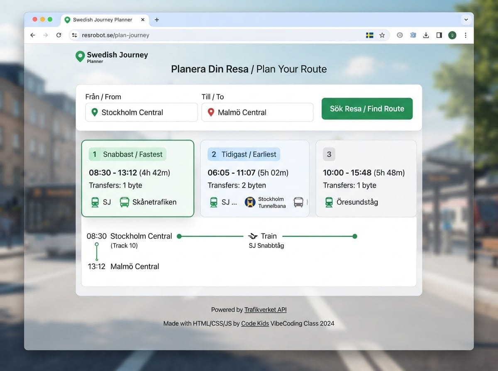
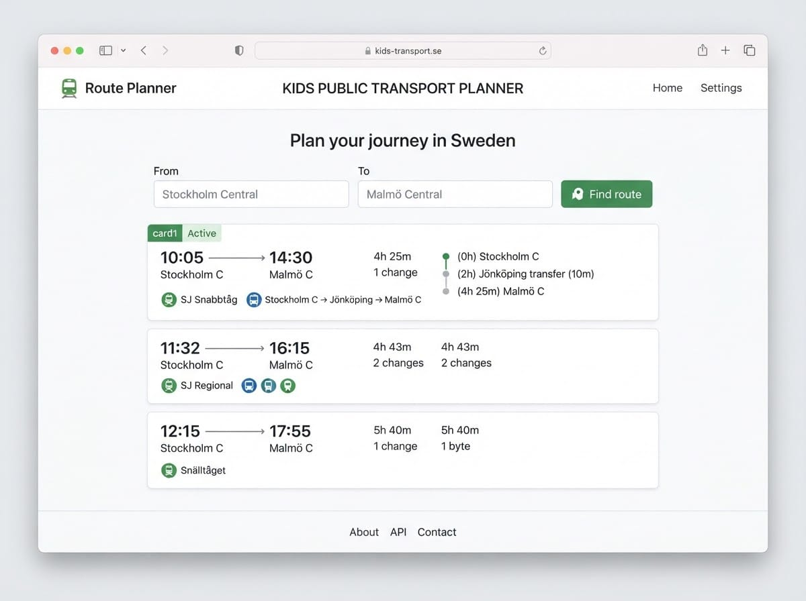
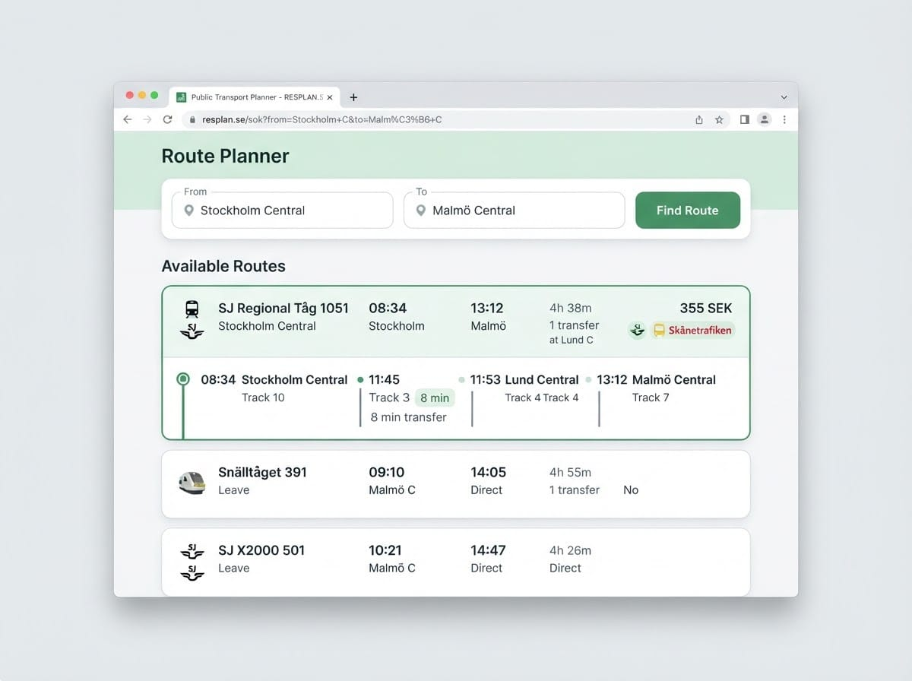

# Project 2 — Public Transport Route Planner  
Projekt 2 — Kollektivtrafik-ruttplanerare

> **Day 6–7 project guide / Projektguide Dag 6–7**
> Build a **one-page** route planner with plain **HTML, CSS, and JavaScript** — no frameworks. You will publish it on **GitHub Pages**, so keep everything in one `index.html` file.
>
> Bygg en **ensidig** ruttplanerare med ren **HTML, CSS och JavaScript** — inga ramverk. Du ska publicera den på **GitHub Pages**, så håll allt i en `index.html`-fil.

---

## What you'll build / Vad du ska bygga

**English**
A simple page where a new student types **From** and **To** (e.g. Stockholm Central → Malmö Central), presses **Find route**, and sees public transport options in Sweden (departure, arrival, duration, transfers).

**Svenska**
En enkel sida där en ny student skriver **Från** och **Till** (t.ex. Stockholm Central → Malmö Central), trycker **Hitta rutt**, och ser kollektivtrafikalternativ i Sverige (avgång, ankomst, tid, byten).

**User story / Användarberättelse:**

> As a new student in Sweden, I want to enter two places and see how to travel between them by public transport.
> *Som ny student i Sverige vill jag skriva in två platser och se hur jag reser mellan dem med kollektivtrafik.*

**Rules for GitHub Pages / Regler för GitHub Pages:**

- One-page app / Ensidig app
- Plain HTML/CSS/JS only / Bara ren HTML/CSS/JS
- No build tools, no npm, no frameworks / Inga byggverktyg, inget npm, inga ramverk
- File must be named `index.html` / Filen måste heta `index.html`

**Important — API key / Viktigt — API-nyckel:**
This API needs a **free Trafiklab key**. You will type it into an input on the page — **never hard-code it** in `index.html` before you push to a **public** GitHub repo (Day 5 security rule).
*Detta API behöver en **gratis Trafiklab-nyckel**. Du skriver in den i ett fält på sidan — **hårdkoda den aldrig** i* `index.html` *innan du push:ar till ett **offentligt** GitHub-repo (säkerhetsregeln från Dag 5).*

**You need / Du behöver:** VS Code + browser + free [Trafiklab](https://www.trafiklab.se/) account + GitHub account

---


## Illustrations / Illustrationer

*Example layouts — inspiration only. Build a simple version first!*
*Exempel-layouts — bara inspiration. Bygg en enkel version först!*






---


# Part 0 — Get a free API key /   
Hämta en gratis API-nyckel

**English**

1. Go to [trafiklab.se](https://www.trafiklab.se/) and create a free account.
2. Create a project and add the **ResRobot v2.1** API.
3. Copy your **API key** (`accessId`).
4. Keep it private — treat it like a password.

**Svenska**

1. Gå till [trafiklab.se](https://www.trafiklab.se/) och skapa ett gratis konto.
2. Skapa ett projekt och lägg till API:et **ResRobot v2.1**.
3. Kopiera din **API-nyckel** (`accessId`).
4. Håll den privat — behandla den som ett lösenord.

> Teachers can help if registration is confusing. Do **not** paste your key into WhatsApp or commit it to GitHub.
> *Lärare kan hjälpa om registreringen är krånglig. Klistra **inte** in nyckeln i WhatsApp eller commit:a den till GitHub.*

---


# Part 1 — Build a simple version by hand /   
Del 1 — Bygg en enkel version för hand

> Goal: a working route planner with **very little CSS**. Understand every line before using Cline.
> Mål: en fungerande ruttplanerare med **väldigt lite CSS**. Förstå varje rad innan du använder Cline.

**The app loop / App-loopen:**

```text
User types From + To + API key
        ↓
Search stop names (location.name) → get extId for each
        ↓
Plan trip (trip) with originId + destId
        ↓
Show route cards on the page
```

---


## Step 1 — See the API in the browser / Steg 1 — Se API:et i webbläsaren

**English**
Replace `YOUR_KEY` with your Trafiklab key and open this URL:

**Svenska**
Ersätt `YOUR_KEY` med din Trafiklab-nyckel och öppna denna URL:

```text
https://api.resrobot.se/v2.1/location.name?input=Stockholm%20Central&format=json&accessId=YOUR_KEY
```

**What you should notice / Vad du ska lägga märke till:**

- Results are often in `stopLocationOrCoordLocation` — an array
- Each item has a nested `StopLocation`
- Use `extId` (not the long internal `id`) when planning a trip
- Useful fields: `name`, `extId`, `lat`, `lon`

Then try a trip with known station ids (no lookup needed):

```text
https://api.resrobot.se/v2.1/trip?format=json&originId=740000001&destId=740000003&passlist=true&accessId=YOUR_KEY
```

*(740000001 = Stockholm Central, 740000003 = Malmö Central)*

Look for a `Trip` array. Each trip has things like:

- `Origin` / `Destination` (with `time`, `date`, `name`)
- `duration` (e.g. `PT4H32M`)
- `LegList.Leg` — the steps of the journey

---


## Step 2 — Create the project file /   
Steg 2 — Skapa projektfilen

**English**

1. Create a folder, e.g. `route-planner`.
2. Create `index.html`.
3. Start with this skeleton:

**Svenska**

1. Skapa en mapp, t.ex. `route-planner`.
2. Skapa `index.html`.
3. Börja med denna grundram:

```html
<!DOCTYPE html>
<html lang="en">
  <head>
    <meta charset="UTF-8">
    <meta name="viewport" content="width=device-width, initial-scale=1.0">
    <title>Route Planner</title>
  </head>
  <body>
    <!-- content goes here -->
  </body>
</html>
```

---


## Step 3 — Add the page structure (HTML) /   
Steg 3 — Lägg till sidstrukturen (HTML)

**English**
Put this inside `<body>`. Notice the API key field — the user types the key; it is **not** saved in the file.

**Svenska**
Lägg detta inuti `<body>`. Lägg märke till API-nyckelfältet — användaren skriver nyckeln; den **sparas inte** i filen.

```html
<h1>Public Transport Route Planner</h1>
<p>Plan a trip with Swedish public transport (ResRobot).</p>

<label>
  Your Trafiklab API key
  <input id="apiKey" type="password" placeholder="Paste your accessId here" autocomplete="off">
</label>
<br><br>

<label>
  From
  <input id="from" type="text" value="Stockholm Central" placeholder="e.g. Stockholm Central">
</label>
<br><br>

<label>
  To
  <input id="to" type="text" value="Malmö Central" placeholder="e.g. Malmö Central">
</label>
<br><br>

<button id="searchBtn">Find route</button>

<p id="status">Enter your API key, From, and To — then press Find route.</p>
<div id="results"></div>
```

> 🔒 Using `type="password"` hides the key on screen. Still: never commit a real key into the HTML source.
> `type="password"` *döljer nyckeln på skärmen. Ändå: commit:a aldrig en riktig nyckel i HTML-källan.*

---


## Step 4 — Add a tiny bit of CSS /   
Steg 4 — Lägg till en liten bit CSS

**English**
Add this in `<head>` — readable only. Design improvements come in Part 2.

**Svenska**
Lägg till detta i `<head>` — bara läsbart. Designförbättringar kommer i Del 2.

```html
<style>
  body {
    font-family: Arial, sans-serif;
    max-width: 700px;
    margin: 24px auto;
    padding: 0 16px;
    line-height: 1.4;
  }
  input { margin-left: 8px; padding: 4px; min-width: 220px; }
  button { padding: 6px 12px; }
  .trip {
    border-top: 1px solid #ccc;
    padding: 12px 0;
  }
</style>
```

---


## Step 5 — Look up a stop (fetch + console.log) /   
Steg 5 — Sök en hållplats (fetch + console.log)

**English**
First we only look up **From** and log the JSON. Add this before `</body>`:

**Svenska**
Först söker vi bara **Från** och loggar JSON:en. Lägg till detta före `</body>`:

```html
<script>
  const BASE = "https://api.resrobot.se/v2.1";

  function getApiKey() {
    return document.getElementById("apiKey").value.trim();
  }

  // ResRobot returns stops in slightly different shapes — this helper finds them.
  function extractStops(data) {
    const stops = [];
    if (Array.isArray(data.stopLocationOrCoordLocation)) {
      for (const item of data.stopLocationOrCoordLocation) {
        if (item.StopLocation) stops.push(item.StopLocation);
      }
    } else if (Array.isArray(data.StopLocation)) {
      for (const stop of data.StopLocation) stops.push(stop);
    }
    return stops;
  }

  async function findStop(name, apiKey) {
    const url =
      BASE +
      "/location.name?input=" +
      encodeURIComponent(name) +
      "&format=json&accessId=" +
      encodeURIComponent(apiKey);

    const response = await fetch(url);
    if (!response.ok) {
      throw new Error("Stop search failed: " + response.status);
    }
    const data = await response.json();
    console.log("Stop search for:", name, data);
    const stops = extractStops(data);
    if (stops.length === 0) {
      throw new Error("No stop found for: " + name);
    }
    // Prefer extId for trip planning
    return {
      name: stops[0].name,
      extId: stops[0].extId || stops[0].id
    };
  }

  async function testFromStop() {
    const apiKey = getApiKey();
    const fromName = document.getElementById("from").value.trim();
    if (!apiKey) {
      document.getElementById("status").textContent = "Please paste your API key first.";
      return;
    }
    document.getElementById("status").textContent = "Looking up stop…";
    try {
      const stop = await findStop(fromName, apiKey);
      document.getElementById("status").textContent =
        "Found: " + stop.name + " (extId: " + stop.extId + "). Check the Console.";
    } catch (error) {
      console.error(error);
      document.getElementById("status").textContent = error.message;
    }
  }

  document.getElementById("searchBtn").addEventListener("click", testFromStop);
</script>
```

> ▶️ Save, paste your key, click **Find route**. In the Console you should see stop JSON and a status with `extId`.
> *Spara, klistra in nyckeln, klicka **Find route**. I Console ska du se hållplats-JSON och en status med* `extId`*.*

---


## Step 6 — Plan the trip and show results /   
Steg 6 — Planera resan och visa resultat

**English**
Replace the script with the full version: look up **From** and **To**, call **trip**, show a few route options.

**Svenska**
Ersätt skriptet med hela versionen: sök **Från** och **Till**, anropa **trip**, visa några ruttalternativ.

```html
<script>
  const BASE = "https://api.resrobot.se/v2.1";

  function getApiKey() {
    return document.getElementById("apiKey").value.trim();
  }

  function extractStops(data) {
    const stops = [];
    if (Array.isArray(data.stopLocationOrCoordLocation)) {
      for (const item of data.stopLocationOrCoordLocation) {
        if (item.StopLocation) stops.push(item.StopLocation);
      }
    } else if (Array.isArray(data.StopLocation)) {
      for (const stop of data.StopLocation) stops.push(stop);
    }
    return stops;
  }

  async function findStop(name, apiKey) {
    const url =
      BASE +
      "/location.name?input=" +
      encodeURIComponent(name) +
      "&format=json&accessId=" +
      encodeURIComponent(apiKey);

    const response = await fetch(url);
    if (!response.ok) {
      throw new Error("Stop search failed (" + response.status + ") for: " + name);
    }
    const data = await response.json();
    console.log("Stops for", name, data);
    const stops = extractStops(data);
    if (stops.length === 0) {
      throw new Error("No stop found for: " + name);
    }
    return {
      name: stops[0].name,
      extId: stops[0].extId || stops[0].id
    };
  }

  async function planTrip(originId, destId, apiKey) {
    const url =
      BASE +
      "/trip?format=json" +
      "&originId=" + encodeURIComponent(originId) +
      "&destId=" + encodeURIComponent(destId) +
      "&passlist=true" +
      "&accessId=" + encodeURIComponent(apiKey);

    const response = await fetch(url);
    if (!response.ok) {
      throw new Error("Trip planning failed: " + response.status);
    }
    const data = await response.json();
    console.log("Trip response", data);
    return data;
  }

  function formatDuration(duration) {
    // Example: PT4H32M → 4h 32m
    if (!duration) return "Unknown";
    const hours = duration.match(/(\d+)H/);
    const mins = duration.match(/(\d+)M/);
    let text = "";
    if (hours) text += hours[1] + "h ";
    if (mins) text += mins[1] + "m";
    return text.trim() || duration;
  }

  function countTransfers(trip) {
    const legs = trip.LegList && trip.LegList.Leg;
    if (!legs) return 0;
    const list = Array.isArray(legs) ? legs : [legs];
    // Transfers ≈ number of transport legs minus 1 (ignore pure walks if you want later)
    return Math.max(0, list.length - 1);
  }

  function showTrips(data) {
    const results = document.getElementById("results");
    results.innerHTML = "";

    let trips = data.Trip;
    if (!trips) {
      document.getElementById("status").textContent = "No routes found. Try other stop names.";
      return;
    }
    if (!Array.isArray(trips)) trips = [trips];

    document.getElementById("status").textContent = "Showing " + trips.length + " route option(s):";

    trips.forEach(function (trip, index) {
      const origin = trip.Origin || {};
      const destination = trip.Destination || {};
      const dep = (origin.date || "") + " " + (origin.time || "");
      const arr = (destination.date || "") + " " + (destination.time || "");
      const fromName = origin.name || "Start";
      const toName = destination.name || "End";

      const div = document.createElement("div");
      div.className = "trip";
      div.innerHTML =
        "<h2>Option " + (index + 1) + "</h2>" +
        "<p><strong>From:</strong> " + fromName + "</p>" +
        "<p><strong>To:</strong> " + toName + "</p>" +
        "<p><strong>Departure:</strong> " + dep + "</p>" +
        "<p><strong>Arrival:</strong> " + arr + "</p>" +
        "<p><strong>Duration:</strong> " + formatDuration(trip.duration) + "</p>" +
        "<p><strong>Steps / transfers (approx.):</strong> " + countTransfers(trip) + "</p>";

      results.appendChild(div);
    });
  }

  async function searchRoute() {
    const apiKey = getApiKey();
    const fromName = document.getElementById("from").value.trim();
    const toName = document.getElementById("to").value.trim();

    if (!apiKey) {
      document.getElementById("status").textContent = "Please paste your API key first.";
      return;
    }
    if (!fromName || !toName) {
      document.getElementById("status").textContent = "Please enter both From and To.";
      return;
    }

    document.getElementById("status").textContent = "Searching stops and planning route…";
    document.getElementById("results").innerHTML = "";

    try {
      const fromStop = await findStop(fromName, apiKey);
      const toStop = await findStop(toName, apiKey);
      const tripData = await planTrip(fromStop.extId, toStop.extId, apiKey);
      showTrips(tripData);
    } catch (error) {
      console.error(error);
      document.getElementById("status").textContent = error.message || "Something went wrong.";
    }
  }

  document.getElementById("searchBtn").addEventListener("click", searchRoute);
</script>
```

> ▶️ Test: API key + `Stockholm Central` → `Malmö Central`. You should see several route options.
> *Testa: API-nyckel +* `Stockholm Central` *→* `Malmö Central`*. Du ska se flera ruttalternativ.*

---


## Step 7 — Test your core features /   
Steg 7 — Testa dina kärnfunktioner


| Test / Test                        | What to check / Vad du ska kolla |
| ---------------------------------- | -------------------------------- |
| Stockholm Central → Malmö Central  | Several trip options appear      |
| Göteborg Central → Uppsala Central | Different routes / times         |
| Missing API key                    | Friendly message                 |
| Nonsense place name                | “No stop found…” (or similar)    |
| Console open                       | You can see stop + trip JSON     |


---


## The complete simple page / Den kompletta enkla sidan

```html
<!DOCTYPE html>
<html lang="en">
  <head>
    <meta charset="UTF-8">
    <meta name="viewport" content="width=device-width, initial-scale=1.0">
    <title>Route Planner</title>
    <style>
      body {
        font-family: Arial, sans-serif;
        max-width: 700px;
        margin: 24px auto;
        padding: 0 16px;
        line-height: 1.4;
      }
      input { margin-left: 8px; padding: 4px; min-width: 220px; }
      button { padding: 6px 12px; }
      .trip {
        border-top: 1px solid #ccc;
        padding: 12px 0;
      }
    </style>
  </head>
  <body>
    <h1>Public Transport Route Planner</h1>
    <p>Plan a trip with Swedish public transport (ResRobot).</p>

    <label>
      Your Trafiklab API key
      <input id="apiKey" type="password" placeholder="Paste your accessId here" autocomplete="off">
    </label>
    <br><br>

    <label>
      From
      <input id="from" type="text" value="Stockholm Central" placeholder="e.g. Stockholm Central">
    </label>
    <br><br>

    <label>
      To
      <input id="to" type="text" value="Malmö Central" placeholder="e.g. Malmö Central">
    </label>
    <br><br>

    <button id="searchBtn">Find route</button>

    <p id="status">Enter your API key, From, and To — then press Find route.</p>
    <div id="results"></div>

    <script>
      const BASE = "https://api.resrobot.se/v2.1";

      function getApiKey() {
        return document.getElementById("apiKey").value.trim();
      }

      function extractStops(data) {
        const stops = [];
        if (Array.isArray(data.stopLocationOrCoordLocation)) {
          for (const item of data.stopLocationOrCoordLocation) {
            if (item.StopLocation) stops.push(item.StopLocation);
          }
        } else if (Array.isArray(data.StopLocation)) {
          for (const stop of data.StopLocation) stops.push(stop);
        }
        return stops;
      }

      async function findStop(name, apiKey) {
        const url =
          BASE +
          "/location.name?input=" +
          encodeURIComponent(name) +
          "&format=json&accessId=" +
          encodeURIComponent(apiKey);

        const response = await fetch(url);
        if (!response.ok) {
          throw new Error("Stop search failed (" + response.status + ") for: " + name);
        }
        const data = await response.json();
        console.log("Stops for", name, data);
        const stops = extractStops(data);
        if (stops.length === 0) {
          throw new Error("No stop found for: " + name);
        }
        return {
          name: stops[0].name,
          extId: stops[0].extId || stops[0].id
        };
      }

      async function planTrip(originId, destId, apiKey) {
        const url =
          BASE +
          "/trip?format=json" +
          "&originId=" + encodeURIComponent(originId) +
          "&destId=" + encodeURIComponent(destId) +
          "&passlist=true" +
          "&accessId=" + encodeURIComponent(apiKey);

        const response = await fetch(url);
        if (!response.ok) {
          throw new Error("Trip planning failed: " + response.status);
        }
        const data = await response.json();
        console.log("Trip response", data);
        return data;
      }

      function formatDuration(duration) {
        if (!duration) return "Unknown";
        const hours = duration.match(/(\d+)H/);
        const mins = duration.match(/(\d+)M/);
        let text = "";
        if (hours) text += hours[1] + "h ";
        if (mins) text += mins[1] + "m";
        return text.trim() || duration;
      }

      function countTransfers(trip) {
        const legs = trip.LegList && trip.LegList.Leg;
        if (!legs) return 0;
        const list = Array.isArray(legs) ? legs : [legs];
        return Math.max(0, list.length - 1);
      }

      function showTrips(data) {
        const results = document.getElementById("results");
        results.innerHTML = "";

        let trips = data.Trip;
        if (!trips) {
          document.getElementById("status").textContent = "No routes found. Try other stop names.";
          return;
        }
        if (!Array.isArray(trips)) trips = [trips];

        document.getElementById("status").textContent = "Showing " + trips.length + " route option(s):";

        trips.forEach(function (trip, index) {
          const origin = trip.Origin || {};
          const destination = trip.Destination || {};
          const dep = (origin.date || "") + " " + (origin.time || "");
          const arr = (destination.date || "") + " " + (destination.time || "");
          const fromName = origin.name || "Start";
          const toName = destination.name || "End";

          const div = document.createElement("div");
          div.className = "trip";
          div.innerHTML =
            "<h2>Option " + (index + 1) + "</h2>" +
            "<p><strong>From:</strong> " + fromName + "</p>" +
            "<p><strong>To:</strong> " + toName + "</p>" +
            "<p><strong>Departure:</strong> " + dep + "</p>" +
            "<p><strong>Arrival:</strong> " + arr + "</p>" +
            "<p><strong>Duration:</strong> " + formatDuration(trip.duration) + "</p>" +
            "<p><strong>Steps / transfers (approx.):</strong> " + countTransfers(trip) + "</p>";

          results.appendChild(div);
        });
      }

      async function searchRoute() {
        const apiKey = getApiKey();
        const fromName = document.getElementById("from").value.trim();
        const toName = document.getElementById("to").value.trim();

        if (!apiKey) {
          document.getElementById("status").textContent = "Please paste your API key first.";
          return;
        }
        if (!fromName || !toName) {
          document.getElementById("status").textContent = "Please enter both From and To.";
          return;
        }

        document.getElementById("status").textContent = "Searching stops and planning route…";
        document.getElementById("results").innerHTML = "";

        try {
          const fromStop = await findStop(fromName, apiKey);
          const toStop = await findStop(toName, apiKey);
          const tripData = await planTrip(fromStop.extId, toStop.extId, apiKey);
          showTrips(tripData);
        } catch (error) {
          console.error(error);
          document.getElementById("status").textContent = error.message || "Something went wrong.";
        }
      }

      document.getElementById("searchBtn").addEventListener("click", searchRoute);
    </script>
  </body>
</html>
```

> ✅ **Part 1 done** when routes appear and you can explain: key → stop lookup → trip → display.
> ***Del 1 klar** när rutter visas och du kan förklara: nyckel → hållplatssök → resa → visning.*

---


# Part 2 — Improve it with AI (Cline) /  
Del 2 — Förbättra den med AI (Cline)

**English**
Use **Cline** to improve the page **one change at a time**. Keep a **single static** HTML/CSS/JS file for GitHub Pages.

**Svenska**
Använd **Cline** för att förbättra sidan **en ändring i taget**. Behåll en **ensidig statisk** HTML/CSS/JS-fil för GitHub Pages.

**Always remind Cline / Påminn alltid Cline:**

```text
Keep this as one plain HTML/CSS/JS file for GitHub Pages.
Do not add frameworks, npm, or a backend.
Never hard-code my Trafiklab API key in the source file.
```

> 🏅 Golden rule: explain every AI change. / Gyllene regel: förklara varje AI-ändring.

---


## Sample prompts — Design & layout /   
Exempel-prompts — Design & layout

```text
Improve the visual design of my Route Planner with CSS only in the same index.html. Clean student-friendly look, better spacing, max-width layout. Keep all JavaScript behavior. No frameworks. Short CSS comments.
```

```text
Turn each trip option into a simple card with border, padding, and rounded corners. Plain HTML/CSS/JS for GitHub Pages only.
```

```text
Put From, To, and Find route in a clearer form layout (stacked on mobile, nicer on desktop) using only CSS flexbox/media queries. No frameworks.
```

```text
Style the API key field carefully so it looks like a private settings field (smaller label, password input stays). Do not log or save the key to the file.
```

```text
Add icons or short labels for train/bus if Product/name fields exist in legs — but keep it simple and do not add external icon libraries if possible.
```

---


## Sample prompts — User experience /   
Exempel-prompts — Användarupplevelse

```text
When I press Enter in From or To, run the same search as the Find route button. Plain JavaScript only. Explain the change.
```

```text
Disable the Find route button while loading, re-enable when finished (success or error). Keep one index.html file.
```

```text
Show progress status in steps: "1/3 Looking up From…" then "2/3 Looking up To…" then "3/3 Planning trip…". Do not change the API endpoints.
```

```text
Add a Swap button that swaps the From and To values.
```

```text
If no routes are found, show a friendly empty state with example searches (Stockholm Central → Malmö Central, Göteborg Central → Uppsala Central).
```

```text
Let me choose which stop to use when location.name returns multiple matches:
show a short list of the top 3 stop names for From and To before planning. Keep it one page, no frameworks.
```

---


## Sample prompts — Extra features /   
Exempel-prompts — Extrafunktioner

```text
For each trip option, list the legs (LegList.Leg): for each leg show name/type if available, and origin/destination times. Keep plain JS and one HTML file.
```

```text
Sort displayed trips by duration (shortest first). Explain the sorting code.
```

```text
Show the number of transfers more accurately by counting only non-WALK legs if Product or type fields exist. Add short comments.
```

```text
Add a checkbox "Show only trips with at most 1 transfer" that filters results on the page after fetch (client-side).
```

```text
Add fuzzy search tip: if the first stop lookup fails, retry once with a "?" appended to the input (ResRobot fuzzy search). Explain in a comment.
```

```text
Optional bonus: add a "Nearby stops" demo section with fixed coordinates for Göteborg (lat 57.708895, lon 11.973479) calling location.nearbystops. Keep the API key in the input field only — never hard-code it.
```

---


## Sample prompts — Security & language /   
Exempel-prompts — Säkerhet & språk

```text
Add a visible security note under the API key field:
"Never commit your API key to GitHub. Paste it only in this box." English + Swedish.
```

```text
Make main labels bilingual (English / Swedish): From/Från, To/Till, Find route/Hitta rutt, API key/API-nyckel. Keep one HTML file.
```

```text
Improve accessibility: proper label for/id pairs, clear button text, and a status area that is easy to find. Plain HTML only.
```

```text
Add a short About section explaining data comes from Trafiklab ResRobot and this is a student project for newcomers in Sweden.
```

---


## Sample prompts — Code quality /   
Exempel-prompts — Kodkvalitet

```text
Refactor into small named functions (getApiKey, findStop, planTrip, showTrips, formatDuration). Same behavior. Short comments. No frameworks.
```

```text
Add comments that explain why we use extId instead of id for trip planning. Do not change behavior.
```

```text
Review for simple bugs (missing key, empty From/To, API errors, missing Trip array) and fix carefully. Keep one static file for GitHub Pages.
```

---


## After improvements — Publish checklist /   
Efter förbättringar — Publiceringschecklista

**English**

1. Confirm routes still work with your key pasted in the box.
2. Search your `index.html` — there must be **no real API key** in the source.
3. Push to a **public** GitHub repo and enable **GitHub Pages**.
4. Open the live URL, paste your key in the browser, and test a route.
5. For the demo, you can paste the key yourself — do not share it in chat.

**Svenska**

1. Bekräfta att rutter fortfarande fungerar med nyckeln i rutan.
2. Sök i `index.html` — det får **inte finnas någon riktig API-nyckel** i källan.
3. Push:a till ett **offentligt** GitHub-repo och slå på **GitHub Pages**.
4. Öppna live-URL:en, klistra in nyckeln i webbläsaren, och testa en rutt.
5. Under demon kan du klistra in nyckeln själv — dela den inte i chatten.

> Note: On a public page, anyone who opens DevTools can see the key you paste for that session. That is a limit of frontend-only apps. For this course it is OK for learning — rotate/revoke the key later in Trafiklab if needed.
> *Obs: På en offentlig sida kan den som öppnar DevTools se nyckeln du klistrar in för sessionen. Det är en begränsning med bara-frontend-appar. För kursen är det OK för lärande — återkalla/rotera nyckeln senare i Trafiklab vid behov.*

---


## Demo tips (3 minutes) / Demotips (3 minuter)

**English**

- Paste key → search Stockholm Central → Malmö Central.
- Show one route’s departure, arrival, duration.
- Open Console and point to `extId` / `Trip`.
- Explain: From/To → `location.name` → `trip` → cards.
- Mention you never committed the API key.

**Svenska**

- Klistra in nyckel → sök Stockholm Central → Malmö Central.
- Visa en rutts avgång, ankomst, tid.
- Öppna Console och peka på `extId` / `Trip`.
- Förklara: Från/Till → `location.name` → `trip` → kort.
- Nämn att du aldrig commit:ade API-nyckeln.

---


## API reference (quick) / API-referens (snabb)

```text
GET https://api.resrobot.se/v2.1/location.name?input=NAME&format=json&accessId=KEY
GET https://api.resrobot.se/v2.1/trip?format=json&originId=EXTID&destId=EXTID&passlist=true&accessId=KEY
```

- Stop id for trips: `extId`
- Known examples: Stockholm Central `740000001`, Malmö Central `740000003`
- Optional later: `location.nearbystops`

Docs: [Trafiklab ResRobot v2.1](https://www.trafiklab.se/api/our-apis/resrobot-v21/)

---

*Part of teknikkurs26 — Summer Coding Course for Youth · Sudanese Association*