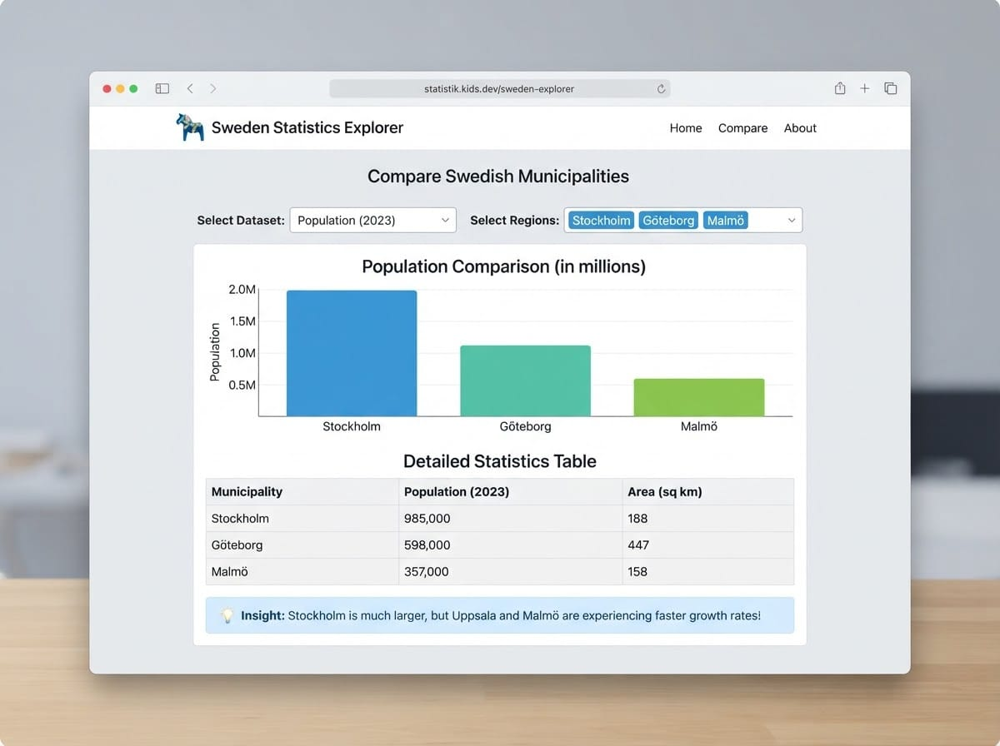
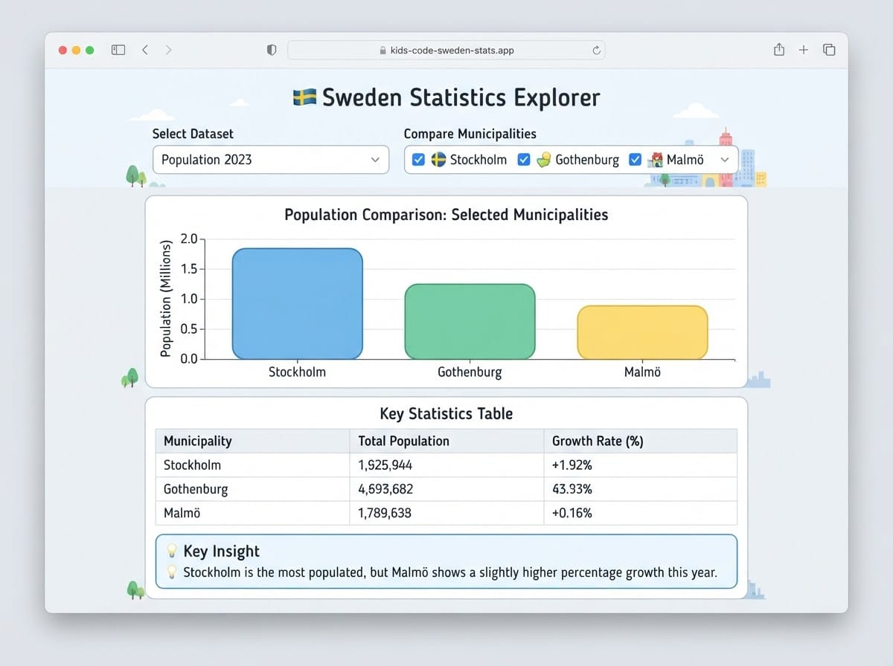
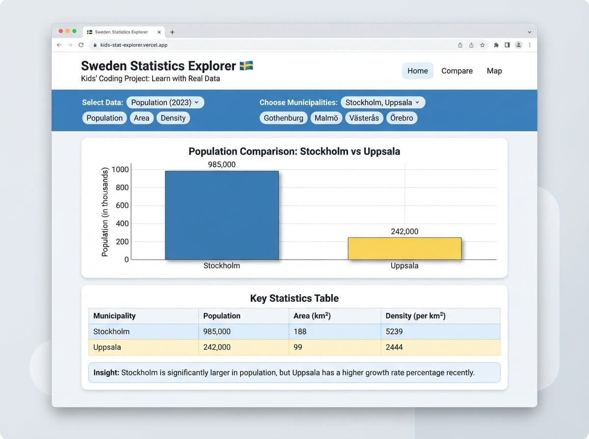

# Project 3 — Sweden Statistics Explorer

# Projekt 3 — Sverigestatistik-utforskare

> **Day 6–7 project guide / Projektguide Dag 6–7**
> Build a **one-page** statistics explorer with plain **HTML, CSS, and JavaScript** — no frameworks, no chart libraries in Part 1. Publish on **GitHub Pages** as `index.html`.
>
> Bygg en **ensidig** statistikutforskare med ren **HTML, CSS och JavaScript** — inga ramverk, inga diagrambibliotek i Del 1. Publicera på **GitHub Pages** som `index.html`.

---

## What you'll build / Vad du ska bygga

**English**
A simple dashboard that loads Swedish population-style data from **Apiverket**, shows a **table**, a **simple CSS bar chart**, and one short **insight** sentence. Later (Part 2) you can compare municipalities and polish the design with Cline.

**Svenska**
En enkel dashboard som hämtar svensk befolkningsdata från **Apiverket**, visar en **tabell**, ett **enkelt CSS-stapeldiagram**, och en kort **insikt**. Senare (Del 2) kan du jämföra kommuner och putsa designen med Cline.

**User story / Användarberättelse:**

> As a student, I want to compare Swedish municipalities using real statistics, so I can understand Sweden better through data.
> *Som student vill jag jämföra svenska kommuner med riktig statistik, så att jag förstår Sverige bättre genom data.*

**Rules / Regler:** one page · plain HTML/CSS/JS · no npm/React · `index.html` for GitHub Pages

**API auth / API-auth:** Apiverket needs a Bearer token. For learning they document a **test token**: `sk_test_demo`. Paste it in an input — **do not commit a private production key** to a public repo.

**You need / Du behöver:** VS Code + browser + GitHub account

---


## Illustrations / Illustrationer

*Example layouts — inspiration only. Build a simple version first!*
*Exempel-layouts — bara inspiration. Bygg en enkel version först!*






---


# Part 1 — Build a simple version by hand /

Del 1 — Bygg en enkel version för hand

---


## Step 1 — See the API in the browser /

Steg 1 — Se API:et i webbläsaren

**English**
Apiverket needs a header, so the easiest first check is with a small `fetch` later — or ask a teacher to show a sample response. Documented call:

**Svenska**
Apiverket behöver en header, så enklaste första koll är med `fetch` senare — eller be en lärare visa ett exempel-svar. Dokumenterat anrop:

```text
GET https://apiverket.se/v1/population
Header: Authorization: Bearer sk_test_demo
```

**Expect / Förvänta dig:** a JSON object with something like `meta` and `data` (a list of rows). Field names can vary — always `console.log` first and adapt.

> Advanced option later: raw SCB PxWeb API (POST). Skip it in Part 1.
> *Avancerat alternativ senare: rå SCB PxWeb API (POST). Hoppa över det i Del 1.*

---


## Step 2 — Create `index.html` /

Steg 2 — Skapa `index.html`

```html
<!DOCTYPE html>
<html lang="en">
  <head>
    <meta charset="UTF-8">
    <meta name="viewport" content="width=device-width, initial-scale=1.0">
    <title>Sweden Statistics Explorer</title>
  </head>
  <body>
    <!-- content -->
  </body>
</html>
```

---


## Step 3 — Page structure /

Steg 3 — Sidstruktur

```html
<h1>Sweden Statistics Explorer</h1>
<p>Explore population-style open data (Apiverket test mode).</p>

<label>
  Bearer token
  <input id="token" type="password" value="sk_test_demo" autocomplete="off">
</label>
<br><br>

<button id="loadBtn">Load data</button>

<p id="status">Click Load data to fetch statistics.</p>
<p id="insight"></p>
<div id="chart"></div>
<div id="table"></div>
```

---


## Step 4 — Tiny CSS /

Steg 4 — Lite CSS

```html
<style>
  body {
    font-family: Arial, sans-serif;
    max-width: 800px;
    margin: 24px auto;
    padding: 0 16px;
    line-height: 1.4;
  }
  table { border-collapse: collapse; width: 100%; margin-top: 16px; }
  th, td { border: 1px solid #ccc; padding: 6px 8px; text-align: left; }
  .bar-row { display: flex; align-items: center; gap: 8px; margin: 6px 0; }
  .bar-label { width: 120px; font-size: 13px; }
  .bar {
    height: 16px;
    background: #2b6cb0;
    min-width: 2px;
  }
</style>
```

---


## Step 5 — Fetch and log /

Steg 5 — Hämta och logga

```html
<script>
  async function loadData() {
    const token = document.getElementById("token").value.trim();
    if (!token) {
      document.getElementById("status").textContent = "Please enter a Bearer token.";
      return;
    }

    document.getElementById("status").textContent = "Loading…";

    try {
      const response = await fetch("https://apiverket.se/v1/population", {
        headers: { Authorization: "Bearer " + token }
      });
      if (!response.ok) throw new Error("API error: " + response.status);
      const payload = await response.json();
      console.log(payload);
      document.getElementById("status").textContent =
        "Data loaded — inspect the Console, then we will render it.";
      window.__statsPayload = payload; // temporary for the next step
    } catch (error) {
      console.error(error);
      document.getElementById("status").textContent = error.message || "Request failed.";
    }
  }

  document.getElementById("loadBtn").addEventListener("click", loadData);
</script>
```

> Open Console and note the shape of `data` (array? objects? which keys?).
> *Öppna Console och notera formen på* `data` *(array? objekt? vilka nycklar?).*

---


## Step 6 — Normalize rows, table, CSS bars, insight /

Steg 6 — Normalisera rader, tabell, staplar, insikt

**English**
Because API field names can change, we write a flexible helper: pick common keys if present, otherwise show whatever we find.

**Svenska**
Eftersom fältnamn kan ändras skriver vi en flexibel hjälpfunktion: välj vanliga nycklar om de finns, annars visa det vi hittar.

Replace the script with:

```html
<script>
  function pick(obj, keys) {
    for (const key of keys) {
      if (obj && obj[key] !== undefined && obj[key] !== null && obj[key] !== "") {
        return obj[key];
      }
    }
    return null;
  }

  function normalizeRows(payload) {
    let rows = payload.data;
    if (!rows) rows = payload;
    if (!Array.isArray(rows)) {
      // sometimes data is nested
      if (rows && Array.isArray(rows.items)) rows = rows.items;
      else if (rows && Array.isArray(rows.results)) rows = rows.results;
      else rows = [];
    }

    return rows.map(function (row) {
      const name =
        pick(row, ["municipality", "region", "name", "label", "kommun", "Region"]) ||
        "Unknown";
      let value = pick(row, ["population", "value", "count", "folkmangd", "Pop"]);
      if (typeof value === "string") value = Number(value.replace(/\s/g, ""));
      if (typeof value !== "number" || Number.isNaN(value)) value = 0;
      return { name: String(name), value: value, raw: row };
    }).filter(function (r) { return r.value > 0; });
  }

  function showTable(rows) {
    const el = document.getElementById("table");
    if (rows.length === 0) {
      el.innerHTML = "<p>No rows to show. Check Console for the real JSON shape.</p>";
      return;
    }
    let html = "<table><tr><th>Name / Namn</th><th>Value / Värde</th></tr>";
    rows.slice(0, 20).forEach(function (r) {
      html += "<tr><td>" + r.name + "</td><td>" + r.value.toLocaleString("sv-SE") + "</td></tr>";
    });
    html += "</table>";
    el.innerHTML = html;
  }

  function showChart(rows) {
    const el = document.getElementById("chart");
    const top = rows.slice().sort(function (a, b) { return b.value - a.value; }).slice(0, 8);
    if (top.length === 0) {
      el.innerHTML = "";
      return;
    }
    const max = top[0].value || 1;
    let html = "<h2>Top values (CSS bars)</h2>";
    top.forEach(function (r) {
      const width = Math.round((r.value / max) * 100);
      html +=
        '<div class="bar-row">' +
        '<div class="bar-label">' + r.name + "</div>" +
        '<div class="bar" style="width:' + width + '%"></div>' +
        "<span>" + r.value.toLocaleString("sv-SE") + "</span>" +
        "</div>";
    });
    el.innerHTML = html;
  }

  function showInsight(rows) {
    const sorted = rows.slice().sort(function (a, b) { return b.value - a.value; });
    if (sorted.length < 2) {
      document.getElementById("insight").textContent = "";
      return;
    }
    const a = sorted[0];
    const b = sorted[1];
    document.getElementById("insight").textContent =
      a.name + " has the highest value in this sample (" +
      a.value.toLocaleString("sv-SE") + "), ahead of " + b.name + " (" +
      b.value.toLocaleString("sv-SE") + ").";
  }

  async function loadData() {
    const token = document.getElementById("token").value.trim();
    if (!token) {
      document.getElementById("status").textContent = "Please enter a Bearer token.";
      return;
    }

    document.getElementById("status").textContent = "Loading…";
    document.getElementById("table").innerHTML = "";
    document.getElementById("chart").innerHTML = "";
    document.getElementById("insight").textContent = "";

    try {
      const response = await fetch("https://apiverket.se/v1/population", {
        headers: { Authorization: "Bearer " + token }
      });
      if (!response.ok) throw new Error("API error: " + response.status);
      const payload = await response.json();
      console.log(payload);

      const rows = normalizeRows(payload);
      if (rows.length === 0) {
        document.getElementById("status").textContent =
          "Loaded JSON, but could not find numeric rows. Adapt normalizeRows() using the Console.";
        return;
      }

      document.getElementById("status").textContent = "Showing " + Math.min(rows.length, 20) + " rows.";
      showInsight(rows);
      showChart(rows);
      showTable(rows);
    } catch (error) {
      console.error(error);
      document.getElementById("status").textContent = error.message || "Request failed.";
    }
  }

  document.getElementById("loadBtn").addEventListener("click", loadData);
</script>
```

---


## Step 7 — Test /

Steg 7 — Testa


| Test                     | Check                                                           |
| ------------------------ | --------------------------------------------------------------- |
| Load with `sk_test_demo` | Table + bars + insight appear (or Console shows shape to adapt) |
| Empty token              | Friendly message                                                |
| Wrong token              | Error status                                                    |


---


## Complete simple page /

Komplett enkel sida

Combine Steps 2–6 into one `index.html` (skeleton + structure + CSS + full script above).

> ✅ Part 1 done when you can explain: token → fetch → normalize → table/bars/insight.
> *Del 1 klar när du kan förklara: token → fetch → normalisera → tabell/staplar/insikt.*

---


# Part 2 — Improve it with AI (Cline)  
Del 2 — Förbättra den med AI (Cline)

**English**
Now that the core works, use **Cline** in VS Code to improve the page — **one change at a time**. Keep it a **single static page** suitable for **GitHub Pages** (no React, Vue, Angular, no npm, no Chart.js, no backend).

**Svenska**
Nu när kärnan fungerar, använd **Cline** i VS Code för att förbättra sidan — **en ändring i taget**. Behåll en **ensidig statisk sida** som passar **GitHub Pages** (ingen React, Vue, Angular, inget npm, ingen Chart.js, ingen backend).

**How to work / Så här jobbar du:**

1. Open your `index.html` in VS Code.
2. Open the **Cline** chat (left sidebar).
3. Paste **one** prompt below.
4. **Read** the change → Accept only if you understand it → Test in the browser.
5. If something breaks, Undo and try a clearer prompt.

> 🏅 **Golden rule:** You must be able to explain what the AI changed.
> *Gyllene regel: Du måste kunna förklara vad AI:n ändrade.*

---


## Sample prompts — Design & layout /   
Exempel-prompts — Design & layout

```text
Improve the visual design of my Sweden Statistics Explorer using only CSS in the same index.html file. Keep all existing JavaScript behavior. Use a clean student-friendly dashboard look: clearer spacing, readable fonts, max-width layout, and distinct sections for controls, insight, chart, and table.
This app must stay publishable on GitHub Pages as one static HTML file.
Do not add React, Vue, npm, Chart.js, or any framework.
Explain each CSS change with a short comment.
```

```text
Turn my CSS bar chart into a clearer chart: align labels in a fixed-width column, use rounded bars, add a light track behind each bar, and show the numeric value at the end of each row. Keep using only HTML/CSS (no chart library). Keep one index.html file suitable for GitHub Pages. Do not add frameworks.
```

```text
Style the statistics table with zebra striping, clearer header background, and
better cell padding. If possible with pure CSS, make the header sticky while scrolling. Keep all JS behavior unchanged.
Publishable on GitHub Pages — one plain HTML/CSS/JS file, no frameworks.
```

```text
Add a soft page background and style the main heading, status message, and insight
paragraph more clearly (insight should stand out as a callout). Keep everything in one index.html for GitHub Pages. No npm or frameworks.
```

```text
Improve mobile readability: stack controls vertically on small screens, make the
token input and Load button full-width, and ensure the bar chart labels wrap nicely. Use only CSS media queries. No frameworks. Must remain GitHub Pages–ready.
```

---


## Sample prompts — User experience /   
Exempel-prompts — Användarupplevelse

```text
When I press Enter in the Bearer token field, run the same action as the Load data button. Keep plain HTML/CSS/JS only. Explain the change with a short comment.
This must stay a single static file publishable on GitHub Pages — no frameworks.
```

```text
Disable the Load data button while a request is loading, and enable it again when the request finishes (success or error). Plain JavaScript only in index.html.
Do not add libraries. Keep it GitHub Pages–compatible.
```

```text
Show a clearer loading message, for example "Loading population data…", and if loading succeeds show "Loaded N rows." using the number of normalized rows.
Do not change the API URL. One static HTML file for GitHub Pages, no frameworks.
```

```text
If normalizeRows returns an empty array, show a friendly empty-state in #status and #table that tells me to open the Console and check the JSON shape. Do not add frameworks. Keep one index.html publishable on GitHub Pages.
```

---


## Sample prompts — Extra features /   
Exempel-prompts — Extrafunktioner

```text
Add a text input "Filter by name" above the table that filters the currently displayed rows client-side (by municipality/region name) without calling the API again. Keep the chart in sync with the filtered rows if easy; otherwise filter the table only and explain that in a comment. Plain HTML/CSS/JS only — must be publishable on GitHub Pages, no frameworks.
```

```text
Add two <select> dropdowns labeled "Compare A" and "Compare B", filled from the loaded normalized rows. When both are selected, show their names and values side by side in a small comparison box under the insight.
Do not add Chart.js or any framework. Keep one static index.html for GitHub Pages. Explain the new functions with short comments.
```

```text
If payload.meta exists after fetch, show useful meta fields (title, source, year, or whatever keys exist) in a small "Dataset info" box above the chart.
If meta is missing, hide the box. Plain JS only. GitHub Pages–ready, no frameworks.
```

```text
Make the table sortable: clicking the "Name" header sorts A–Z / Z–A, clicking "Value" sorts high–low / low–high. Keep state in plain JavaScript variables. Do not use jQuery or frameworks. One index.html file for GitHub Pages.
Add short comments explaining the sort logic.
```

```text
Add a number input "Top N for chart" (default 8, min 3, max 20). When data is shown (or when Top N changes), redraw only the CSS bar chart with that many rows.
Do not add chart libraries. Keep one static HTML/CSS/JS file for GitHub Pages.
```

```text
If normalizeRows finds no numeric values, show a developer hint listing Object.keys of the first item in payload.data (if it exists), so I can adapt field names. Keep this educational and simple.
No frameworks — publishable on GitHub Pages as one index.html.
```

---


## Sample prompts — Language & accessibility / Exempel-prompts — Språk & tillgänglighet

```text
Make the page bilingual: show labels in English and Swedish
(e.g. Bearer token / Åtkomsttoken, Load data / Ladda data,
Name / Namn, Value / Värde). Keep one HTML file.
Must stay GitHub Pages–compatible — plain HTML/CSS/JS, no frameworks.
```

```text
Improve accessibility: associate labels with inputs using for/id, give the Load button clear text, and make sure #status is easy to find for screen readers (e.g. role="status"). Plain HTML/CSS/JS only for GitHub Pages.
```

```text
Add a short "About this app" paragraph under the title explaining that data comes from Apiverket / open Swedish statistics, that the Bearer token stays in the input (never hard-code a private key), and that this is a student project for GitHub Pages. Do not change the fetch logic. No frameworks.
```

---


## Sample prompts — Code quality /   
Exempel-prompts — Kodkvalitet

```text
Refactor my script into small named functions (getToken, fetchPopulation, normalizeRows, showTable, showChart, showInsight, loadData). Keep the same behavior.
Add short comments above each function. Do not introduce React, Vue, npm, or Chart.js. The file must remain one static index.html publishable on GitHub Pages.
```

```text
Add short comments above each function explaining what it does, so I can explain the code to my teacher. Do not change behavior.
Keep plain HTML/CSS/JS for GitHub Pages — no frameworks.
```

```text
Review my code for simple bugs (empty token, API errors, missing data fields, broken normalizeRows) and fix them carefully. Keep one static HTML file for GitHub Pages. Never hard-code a private API key into the source.
```

---


## Publish checklist /   
Publiceringschecklista

**English**

1. Works with the token pasted in the box (e.g. `sk_test_demo` for learning).
2. No private production key committed in `index.html`.
3. Push `index.html` to a **public** GitHub repository.
4. Turn on **GitHub Pages** (Settings → Pages → branch `main` / root).
5. Open the live URL and click Load data.

**Svenska**

1. Fungerar med token inklistrad i rutan (t.ex. `sk_test_demo` för lärande).
2. Ingen privat produktionsnyckel commit:ad i `index.html`.
3. Push:a `index.html` till ett **offentligt** GitHub-repository.
4. Slå på **GitHub Pages**.
5. Öppna live-URL:en och klicka Ladda data.


## Demo tips / Demotips

- Load data → show table + bars + insight  
- Open Console and point to `meta` / `data`  
- Explain one Cline improvement


## API reference

```text
GET https://apiverket.se/v1/population
Authorization: Bearer sk_test_demo
```

Optional later: Apiverket SCB tables, raw SCB PxWeb POST.

---

*Part of teknikkurs26 — Sudanese Association*