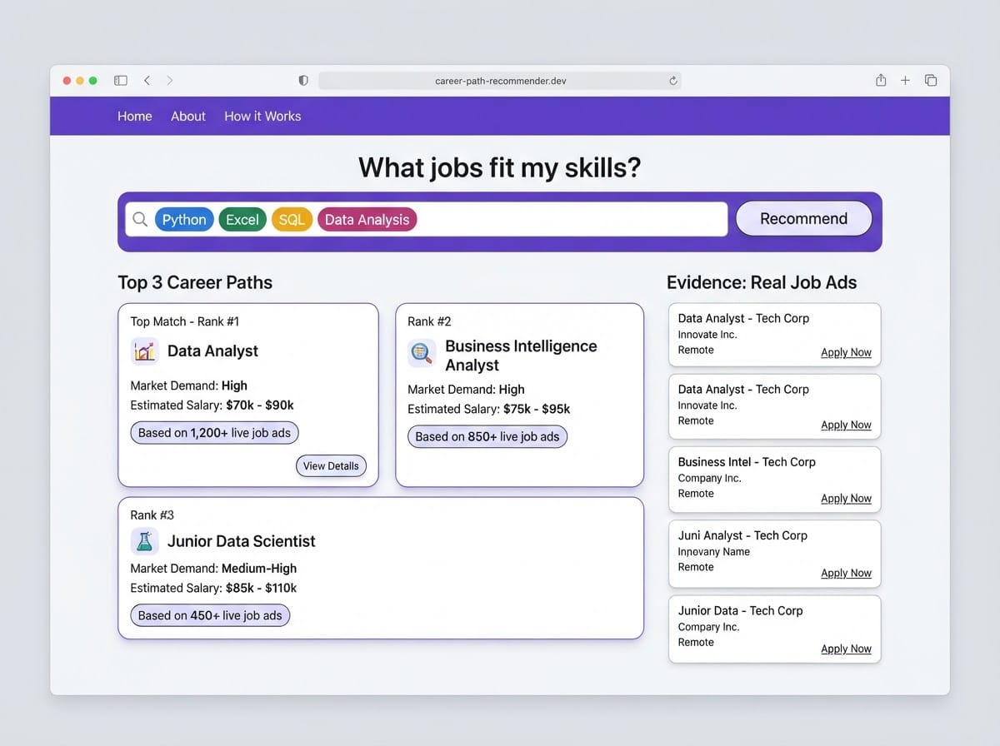
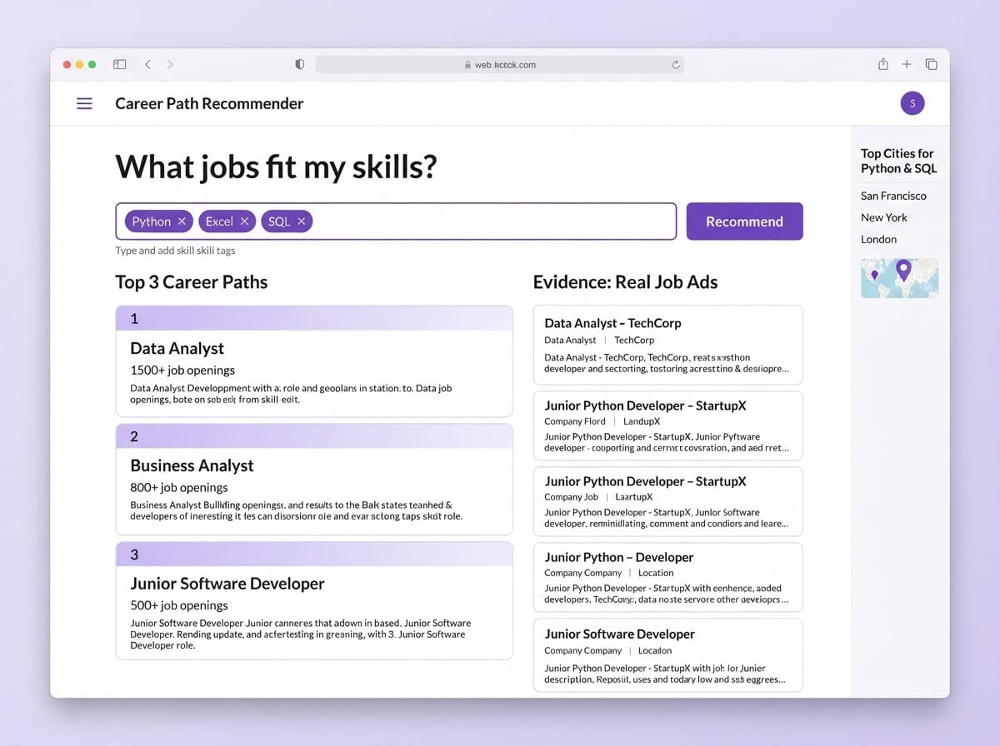
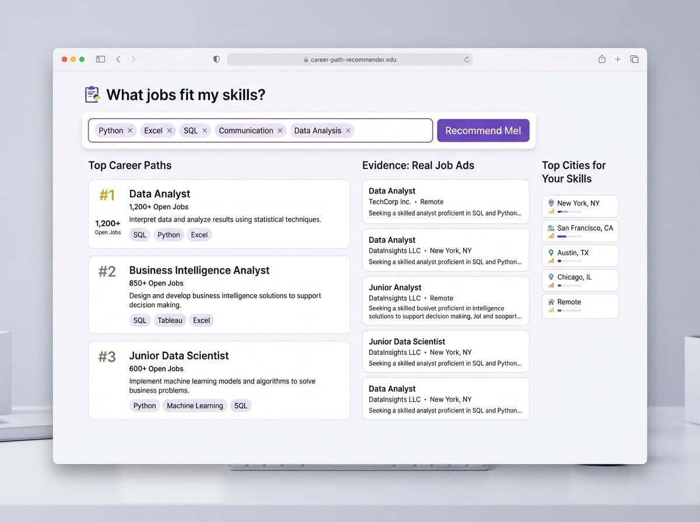

# Project 4 — Career Path Recommender

# Projekt 4 — Karriärvägs-rekommendation

> **Day 6–7 project guide / Projektguide Dag 6–7**
> Build a **one-page** recommender with plain **HTML, CSS, and JavaScript**. No frameworks. Publish on **GitHub Pages** as `index.html`.
>
> Bygg en **ensidig** rekommenderare med ren **HTML, CSS och JavaScript**. Inga ramverk. Publicera på **GitHub Pages** som `index.html`.

---

## What you'll build / Vad du ska bygga

**English**
Enter **3 skills** (e.g. python, excel, sql). The app searches Swedish job ads for each skill, **counts repeated job titles and cities**, then shows:

1. **Top 3 recommended career paths** (most common titles)
2. **Top cities**
3. **Evidence**: a few real job ads that support the recommendation

**Svenska**
Skriv in **3 färdigheter** (t.ex. python, excel, sql). Appen söker svenska jobbannonser för varje färdighet, **räknar upprepade jobbtitlar och städer**, och visar:

1. **Topp 3 rekommenderade karriärvägar**
2. **Topp-städer**
3. **Bevis**: några riktiga jobbannonser som stöder rekommendationen

**User story / Användarberättelse:**

> As a student, I want to enter my skills and see what jobs fit me, so I know what career paths to explore in Sweden.
> *Som student vill jag skriva in mina färdigheter och se vilka jobb som passar, så att jag vet vilka karriärvägar jag kan utforska i Sverige.*

**API / API:** JobSearch (JobTech / Arbetsförmedlingen) — **no API key**  
`https://jobsearch.api.jobtechdev.se/search`

**Rules / Regler:** one page · plain HTML/CSS/JS · GitHub Pages · no frameworks

---

## Illustrations / Illustrationer

*Example layouts — inspiration only. Build a simple version first!*
*Exempel-layouts — bara inspiration. Bygg en enkel version först!*






---

# Part 1 — Build a simple version by hand /

Del 1 — Bygg en enkel version för hand

**Logic / Logik:**

```text
skills = [skill1, skill2, skill3]
for each skill:
    fetch /search?q=skill&limit=20
    for each hit:
        count headline
        count municipality
        save evidence ad
show top 3 titles + top cities + 5 evidence ads
```

---

## Step 1 — See the API /

Steg 1 — Se API:et

Open in the browser:

```text
https://jobsearch.api.jobtechdev.se/search?q=python&limit=5
```

Find `hits[]` with `headline`, `employer.name`, `workplace_address.municipality`, `webpage_url`.

---

## Step 2 — Create `index.html` /

Steg 2 — Skapa `index.html`

```html
<!DOCTYPE html>
<html lang="en">
  <head>
    <meta charset="UTF-8">
    <meta name="viewport" content="width=device-width, initial-scale=1.0">
    <title>Career Path Recommender</title>
  </head>
  <body>
    <!-- content -->
  </body>
</html>
```

---

## Step 3 — Page structure /

Steg 3 — Sidstruktur

```html
<h1>Career Path Recommender</h1>
<p>Enter skills and see which Swedish job titles appear most often.</p>

<label>Skill 1 <input id="skill1" type="text" value="python"></label><br><br>
<label>Skill 2 <input id="skill2" type="text" value="excel"></label><br><br>
<label>Skill 3 <input id="skill3" type="text" value="sql"></label><br><br>

<button id="runBtn">Recommend</button>

<p id="status">Enter 3 skills, then press Recommend.</p>
<div id="paths"></div>
<div id="cities"></div>
<div id="evidence"></div>
```

---

## Step 4 — Tiny CSS /

Steg 4 — Lite CSS

```html
<style>
  body {
    font-family: Arial, sans-serif;
    max-width: 700px;
    margin: 24px auto;
    padding: 0 16px;
    line-height: 1.4;
  }
  input { margin-left: 8px; padding: 4px; }
  button { padding: 6px 12px; }
  .card {
    border-top: 1px solid #ccc;
    padding: 10px 0;
  }
</style>
```

---

## Step 5 — Fetch one skill and log /

Steg 5 — Hämta en färdighet och logga

```html
<script>
  const API = "https://jobsearch.api.jobtechdev.se/search";

  async function searchSkill(skill) {
    const url = API + "?q=" + encodeURIComponent(skill) + "&limit=20";
    const response = await fetch(url);
    if (!response.ok) throw new Error("API error: " + response.status);
    const data = await response.json();
    console.log(skill, data);
    return data.hits || [];
  }

  async function testOne() {
    document.getElementById("status").textContent = "Testing first skill…";
    try {
      const hits = await searchSkill(document.getElementById("skill1").value.trim());
      document.getElementById("status").textContent =
        "Got " + hits.length + " jobs for skill 1 (see Console).";
    } catch (e) {
      document.getElementById("status").textContent = e.message;
    }
  }

  document.getElementById("runBtn").addEventListener("click", testOne);
</script>
```

---

## Step 6 — Count, recommend, show evidence / Steg 6 — Räkna, rekommendera, visa bevis

Replace the script with:

```html
<script>
  const API = "https://jobsearch.api.jobtechdev.se/search";

  async function searchSkill(skill) {
    const url = API + "?q=" + encodeURIComponent(skill) + "&limit=20";
    const response = await fetch(url);
    if (!response.ok) throw new Error("API error for " + skill + ": " + response.status);
    const data = await response.json();
    return data.hits || [];
  }

  function topCounts(counterObj, n) {
    return Object.keys(counterObj)
      .map(function (key) { return { name: key, count: counterObj[key] }; })
      .sort(function (a, b) { return b.count - a.count; })
      .slice(0, n);
  }

  function showList(elementId, title, items) {
    const el = document.getElementById(elementId);
    if (!items.length) {
      el.innerHTML = "<h2>" + title + "</h2><p>No data.</p>";
      return;
    }
    let html = "<h2>" + title + "</h2>";
    items.forEach(function (item, i) {
      html +=
        '<div class="card"><strong>' + (i + 1) + ". " + item.name +
        "</strong> — " + item.count + " matches</div>";
    });
    el.innerHTML = html;
  }

  function showEvidence(ads) {
    const el = document.getElementById("evidence");
    let html = "<h2>Evidence jobs / Bevisjobb</h2>";
    ads.forEach(function (ad) {
      const title = ad.headline || "No title";
      const employer = (ad.employer && ad.employer.name) || "Unknown";
      const city = (ad.workplace_address && ad.workplace_address.municipality) || "Unknown";
      const link = ad.webpage_url || "";
      html +=
        '<div class="card">' +
        "<p><strong>" + title + "</strong></p>" +
        "<p>" + employer + " · " + city + " · skill: " + ad._skill + "</p>" +
        (link ? '<p><a href="' + link + '" target="_blank" rel="noopener">Open ad</a></p>' : "") +
        "</div>";
    });
    el.innerHTML = html;
  }

  async function recommend() {
    const skills = [
      document.getElementById("skill1").value.trim(),
      document.getElementById("skill2").value.trim(),
      document.getElementById("skill3").value.trim()
    ].filter(Boolean);

    if (skills.length === 0) {
      document.getElementById("status").textContent = "Enter at least one skill.";
      return;
    }

    document.getElementById("status").textContent = "Searching jobs for your skills…";
    document.getElementById("paths").innerHTML = "";
    document.getElementById("cities").innerHTML = "";
    document.getElementById("evidence").innerHTML = "";

    const titleCount = {};
    const cityCount = {};
    const evidence = [];

    try {
      for (const skill of skills) {
        const hits = await searchSkill(skill);
        for (const job of hits) {
          const title = job.headline;
          const city = job.workplace_address && job.workplace_address.municipality;
          if (title) titleCount[title] = (titleCount[title] || 0) + 1;
          if (city) cityCount[city] = (cityCount[city] || 0) + 1;
          if (evidence.length < 5) {
            job._skill = skill;
            evidence.push(job);
          }
        }
      }

      const paths = topCounts(titleCount, 3);
      const cities = topCounts(cityCount, 5);

      document.getElementById("status").textContent =
        "Done. Based on " + skills.length + " skill search(es).";
      showList("paths", "Top career paths / Topp karriärvägar", paths);
      showList("cities", "Top cities / Topp städer", cities);
      showEvidence(evidence);
    } catch (error) {
      console.error(error);
      document.getElementById("status").textContent = error.message || "Something went wrong.";
    }
  }

  document.getElementById("runBtn").addEventListener("click", recommend);
</script>
```

---

## Step 7 — Test /

Steg 7 — Testa


| Skills             | Check                               |
| ------------------ | ----------------------------------- |
| python, excel, sql | Top paths + cities + evidence links |
| One skill only     | Still works                         |
| Empty skills       | Friendly message                    |


---

## Complete simple page /

Komplett enkel sida

Combine Steps 2–6 into one `index.html`.

> ✅ Part 1 done when recommendations appear and you can explain the counting logic.
> *Del 1 klar när rekommendationer visas och du kan förklara räknelogiken.*

---

# Part 2 — Improve it with AI (Cline)

# Del 2 — Förbättra den med AI (Cline)

**English**
Now that the core works, use **Cline** in VS Code to improve the page — **one change at a time**. Keep it a **single static page** suitable for **GitHub Pages** (no React, Vue, Angular, no npm, no backend).

**Svenska**
Nu när kärnan fungerar, använd **Cline** i VS Code för att förbättra sidan — **en ändring i taget**. Behåll en **ensidig statisk sida** som passar **GitHub Pages** (ingen React, Vue, Angular, inget npm, ingen backend).

**How to work / Så här jobbar du:**

1. Open your `index.html` in VS Code.
2. Open the **Cline** chat (left sidebar).
3. Paste **one** prompt below.
4. **Read** the change → Accept only if you understand it → Test in the browser.
5. If something breaks, Undo and try a clearer prompt.

> 🏅 **Golden rule:** You must be able to explain what the AI changed.
> *Gyllene regel: Du måste kunna förklara vad AI:n ändrade.*

---

## Sample prompts — Design & layout / Exempel-prompts — Design & layout

```text
Improve the visual design of my Career Path Recommender using only CSS in the same index.html file. Keep all existing JavaScript counting logic. Use a clean student-friendly look: clearer spacing, readable fonts, and a max-width layout with distinct sections for skills form, career paths, cities, and evidence jobs. This app must stay publishable on GitHub Pages as one static HTML file. Do not add React, Vue, npm, or any framework. Explain each CSS change with a short comment.
```

```text
Style the top 3 career path results as highlighted recommendation cards with a light border, padding, rounded corners, and a slightly stronger style for rank #1.
Keep the page as plain HTML/CSS/JS for GitHub Pages. No frameworks.
```

```text
Make the skills form look nicer: stack skill inputs clearly with labels, put the Recommend button below them, and use consistent spacing. On small screens, make inputs and the button full-width using only CSS media queries. No frameworks — must remain GitHub Pages–ready as one index.html.
```

```text
Add a soft page background and style the main heading and status message more clearly. Keep everything in one index.html file for GitHub Pages. No npm.
```

---

## Sample prompts — User experience / Exempel-prompts — Användarupplevelse

```text
Change my form so I can enter 5 skills instead of 3. Keep the same counting logic (search each skill, count occupation titles and cities). Update any loops and labels accordingly. Plain HTML/CSS/JS only.
Must stay publishable on GitHub Pages — no frameworks. Explain the change.
```

```text
Disable the Recommend button while requests are loading, and enable it again when all skill searches finish (success or error). While loading, show progress in #status like "Searching skill 2 of 3…". Plain JavaScript only. One static file for GitHub Pages — do not add frameworks.
```

```text
When I press Enter in any skill input, run the same action as the Recommend button. Keep plain HTML/CSS/JS. Explain the change with a short comment. GitHub Pages–compatible: one index.html, no frameworks.
```

```text
Add a "Clear" button that empties the results sections (paths, cities, evidence) and resets the status message, without reloading the page. Keep one static HTML file for GitHub Pages. No frameworks.
```

```text
If all skill searches return zero jobs, show a friendly empty-state with 2 example skill sets the user can try (for example: python, excel, sql OR vård, svenska, körkort).
Do not change the API URL. Plain JS only for GitHub Pages.
```

---

## Sample prompts — Extra features / Exempel-prompts — Extrafunktioner

```text
Also count employer names (employer.name) across all fetched job ads and show a fourth section "Top employers" with the top 5 employers and their counts. Reuse the same counting pattern as occupations/cities. Add short comments. Keep one index.html publishable on GitHub Pages — no frameworks.
```

```text
Deduplicate evidence job ads by job id so the same advertisement is not listed twice when it matched more than one skill. Keep title, employer, and link. Plain JavaScript only. Must remain a single static file for GitHub Pages.
```

```text
Add a text input "Filter evidence by city" that filters the currently shown evidence jobs client-side (after Recommend), without calling the API again. If the filter matches nothing, show a short message. Plain HTML/CSS/JS — GitHub Pages–ready, no frameworks.
```

```text
Above the results, show a summary line: total number of job ads scanned across all skill searches (sum of hits.length for each skill). Keep the counting logic for paths/cities the same. Explain with a short comment.
One static index.html for GitHub Pages. No frameworks.
```

```text
Add a short note under the career paths section explaining that occupation titles are counted as exact strings from ads (similar titles are not merged). Do not change the counting code yet. Keep the page GitHub Pages–compatible.
```

```text
Sort the displayed career paths and cities by count (highest first) after counting, if they are not already sorted. Explain the sorting with short comments.
Plain JS only — one file for GitHub Pages, no frameworks.
```

---

## Sample prompts — Language & accessibility / Exempel-prompts — Språk & tillgänglighet

```text
Make the page bilingual: show labels in English and Swedish
(e.g. Skill 1 / Kompetens 1, Recommend / Rekommendera,
Career paths / Karriärvägar, Cities / Städer, Evidence / Bevis).
Keep one HTML file. Must stay GitHub Pages–compatible — no frameworks.
```

```text
Improve accessibility: associate labels with skill inputs using for/id, ensure buttons have clear text, and make #status easy to find (e.g. role="status").
Plain HTML/CSS/JS only for GitHub Pages.
```

```text
Add a short "About this app" paragraph under the title explaining that data comes from Arbetsförmedlingen's open JobSearch API, that recommendations are based on simple counting (not AI magic), and that this is a student project for GitHub Pages. Do not change the search logic. No frameworks.
```

---

## Sample prompts — Code quality / Exempel-prompts — Kodkvalitet

```text
Refactor my script into small named functions (getSkills, searchSkill, countTitles,
countCities, showPaths, showCities, showEvidence, recommend). Keep the same behavior.
Add short comments above each function. Do not introduce frameworks. The file must remain one static index.html publishable on GitHub Pages.
```

```text
Add short comments above each function explaining what it does, so I can explain the counting idea to my teacher. Do not change behavior. Keep plain HTML/CSS/JS for GitHub Pages — no frameworks.
```

```text
Review my code for simple bugs (empty skills, missing occupation fields, broken links, race conditions if Recommend is clicked twice) and fix them carefully.
Keep one static HTML file for GitHub Pages. No API key is needed for this API.
```

---

## Publish checklist / Publiceringschecklista

**English**

1. Confirm Recommend still works with e.g. python / excel / sql.
2. No secrets needed for this API — do not invent keys.
3. Push `index.html` to a **public** GitHub repository.
4. Turn on **GitHub Pages** and test the live URL.

**Svenska**

1. Bekräfta att Rekommendera fortfarande fungerar med t.ex. python / excel / sql.
2. Inga hemligheter behövs — hitta inte på nycklar.
3. Push:a `index.html` till ett **offentligt** GitHub-repo.
4. Slå på **GitHub Pages** och testa live-URL:en.

## Demo tips / Demotips

- Run python / excel / sql  
- Explain counting  
- Open one evidence link  
- Mention one Cline improvement

## API reference

```text
GET https://jobsearch.api.jobtechdev.se/search?q=SKILL&limit=20
```

---

*Part of teknikkurs26 — Sudanese Association*