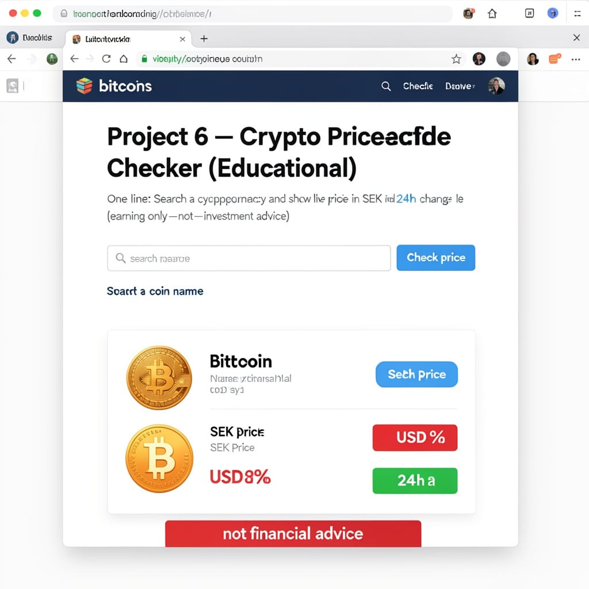
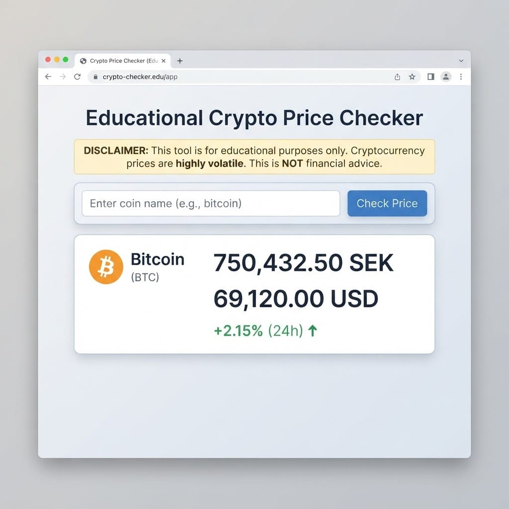
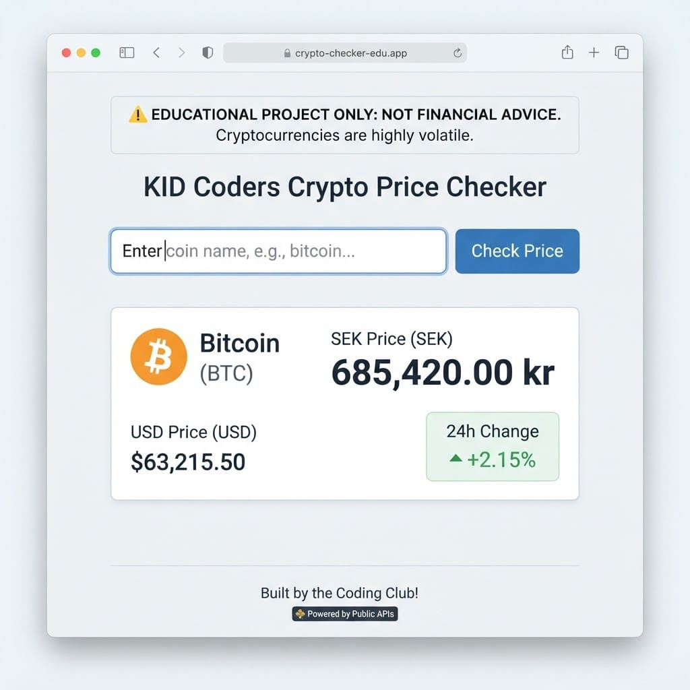

# Project 6 — Crypto Price Checker

# Projekt 6 — Kryptopris-koll

> **Day 6–7 project guide / Projektguide Dag 6–7**
> Build a **one-page** crypto price checker with plain **HTML, CSS, and JavaScript** — no frameworks. Publish on **GitHub Pages** as `index.html`.
>
> Bygg en **ensidig** kryptopris-koll med ren **HTML, CSS och JavaScript** — inga ramverk. Publicera på **GitHub Pages** som `index.html`.

---

## What you'll build /   
Vad du ska bygga

**English**
Search for a cryptocurrency (e.g. Bitcoin), then show its **price in SEK and USD** and the **24-hour change**. Data comes from the free **CoinGecko** API (no key for light use).

**Svenska**
Sök efter en kryptovaluta (t.ex. Bitcoin), visa sedan **priset i SEK och USD** och **24-timmars förändring**. Data kommer från det gratis **CoinGecko**-API:et (ingen nyckel vid lätt användning).

**User story / Användarberättelse:**

> As a curious student, I want to look up a crypto coin’s current price in SEK, so I can practice fetching live financial data — for learning only.
> *Som nyfiken student vill jag kolla en kryptovalutas aktuella pris i SEK, så att jag övar på att hämta live finansiell data — bara för lärande.*

> ⚠️ **Important disclaimer / **  
> ⚠️ **Viktig varning**
> This is an **educational demo**, not financial advice. Crypto prices move fast and you can lose money. Do **not** use this app to decide investments.
> *Detta är en **utbildningsdemo**, inte finansiell rådgivning. Kryptopriser rör sig snabbt och du kan förlora pengar. Använd **inte** denna app för att fatta investeringsbeslut.*

**Rules for GitHub Pages / **  
**Regler för GitHub Pages:**

- One-page app / Ensidig app
- Plain HTML/CSS/JS only / Bara ren HTML/CSS/JS
- No build tools, no npm, no frameworks / Inga byggverktyg, inget npm, inga ramverk
- File must be named `index.html` / Filen måste heta `index.html`
- No API key needed for Part 1 / Ingen API-nyckel behövs i Del 1

**You need / Du behöver:** VS Code + a browser + a GitHub account

**API / API:** [CoinGecko](https://www.coingecko.com/en/api)  
Base: `https://api.coingecko.com/api/v3`


---
## Illustrations / Illustrationer

*Example layouts — inspiration only. Build a simple version first!*
*Exempel-layouts — bara inspiration. Bygg en enkel version först!*






---

# Part 1 — Build a simple version by hand / Del 1 — Bygg en enkel version för hand

> Goal: a working price page with **very little CSS**. Understand every line before using Cline.
> Mål: en fungerande prissida med **väldigt lite CSS**. Förstå varje rad innan du använder Cline.

**App loop / App-loop:**

```text
User types a coin name (e.g. bitcoin)
        ↓
Search API → get coin id
        ↓
Price API → SEK, USD, 24h change
        ↓
Show result on the page
```

---


## Step 1 — See the API in the browser /   
Steg 1 — Se API:et i webbläsaren

**English**
Open these URLs (no key):

**Svenska**
Öppna dessa URL:er (ingen nyckel):

**A) Direct prices for known ids / Direkta priser för kända id:n**

```text
https://api.coingecko.com/api/v3/simple/price?ids=bitcoin,ethereum&vs_currencies=sek,usd&include_24hr_change=true
```

Example shape / Exempelform:

```json
{
  "bitcoin": {
    "sek": 609046,
    "sek_24h_change": -2.37,
    "usd": 63182,
    "usd_24h_change": -2.40
  }
}
```

**B) Search by name / Sök på namn**

```text
https://api.coingecko.com/api/v3/search?query=bitcoin
```

Look in `coins`: each item has `id`, `name`, `symbol`, and sometimes a `thumb` image URL.

> Tip: the `id` (e.g. `bitcoin`) is what you pass to the price endpoint — not always the same as the symbol (`BTC`).
> *Tips: det är* `id` *(t.ex.* `bitcoin`*) du skickar till pris-endpointen — inte alltid samma som symbolen (*`BTC`*).*

---


## Step 2 — Create the project file /   
Steg 2 — Skapa projektfilen

**English**

1. Create a folder, e.g. `crypto-checker`.
2. Create `index.html`.
3. Start with this skeleton:

**Svenska**

1. Skapa en mapp, t.ex. `crypto-checker`.
2. Skapa `index.html`.
3. Börja med denna grundram:

```html
<!DOCTYPE html>
<html lang="en">
  <head>
    <meta charset="UTF-8">
    <meta name="viewport" content="width=device-width, initial-scale=1.0">
    <title>Crypto Price Checker</title>
  </head>
  <body>
    <!-- content goes here -->
  </body>
</html>
```

---


## Step 3 — Add the page structure (HTML) /   
Steg 3 — Lägg till sidstrukturen (HTML)

```html
<h1>Crypto Price Checker</h1>
<p><strong>Educational demo only — not financial advice.</strong></p>
<p>Search a coin and see its price in SEK and USD.</p>

<label>
  Coin name
  <input id="query" type="text" value="bitcoin" placeholder="e.g. bitcoin, ethereum, solana">
</label>
<br><br>

<button id="searchBtn">Check price</button>

<p id="status">Type a coin name, then press Check price.</p>
<div id="result"></div>
```

---


## Step 4 — Add a tiny bit of CSS /   
Steg 4 — Lägg till en liten bit CSS

```html
<style>
  body {
    font-family: Arial, sans-serif;
    max-width: 600px;
    margin: 24px auto;
    padding: 0 16px;
    line-height: 1.4;
  }
  input { margin-left: 8px; padding: 4px; min-width: 200px; }
  button { padding: 6px 12px; }
  .up { color: green; }
  .down { color: darkred; }
  .card {
    border-top: 1px solid #ccc;
    padding: 12px 0;
  }
</style>
```

---


## Step 5 — Fetch price for a known id + console.log /   
Steg 5 — Hämta pris för känt id + console.log

**English**
First, skip search — just price `bitcoin` and log it.

**Svenska**
Först hoppar vi sök — hämta bara pris för `bitcoin` och logga.

```html
<script>
  const API = "https://api.coingecko.com/api/v3";

  async function fetchPrice(coinId) {
    const url =
      API +
      "/simple/price?ids=" +
      encodeURIComponent(coinId) +
      "&vs_currencies=sek,usd&include_24hr_change=true";

    const response = await fetch(url);
    if (!response.ok) {
      throw new Error("Price API error: " + response.status);
    }
    const data = await response.json();
    console.log(data);
    return data;
  }

  async function testBitcoin() {
    document.getElementById("status").textContent = "Loading bitcoin price…";
    try {
      const data = await fetchPrice("bitcoin");
      document.getElementById("status").textContent =
        "Got bitcoin data — see Console. SEK: " + (data.bitcoin && data.bitcoin.sek);
    } catch (error) {
      console.error(error);
      document.getElementById("status").textContent = error.message;
    }
  }

  document.getElementById("searchBtn").addEventListener("click", testBitcoin);
</script>
```

> ▶️ Save, click the button, open Console (`F12`). You should see the bitcoin object.
> *Spara, klicka, öppna Console. Du ska se bitcoin-objektet.*

> If you get **429 Too Many Requests**, wait a minute — free CoinGecko rate-limits apply.
> *Om du får **429**, vänta en minut — gratis CoinGecko har begränsningar.*

---


## Step 6 — Search + show full result /   
Steg 6 — Sök + visa hela resultatet

**English**
Now: search by name → take the first coin → fetch price → show on page.

**Svenska**
Nu: sök på namn → ta första myntet → hämta pris → visa på sidan.

Replace the script with:

```html
<script>
  const API = "https://api.coingecko.com/api/v3";

  async function searchCoin(query) {
    const url = API + "/search?query=" + encodeURIComponent(query);
    const response = await fetch(url);
    if (!response.ok) {
      throw new Error("Search API error: " + response.status);
    }
    const data = await response.json();
    console.log("search", data);
    const coins = data.coins || [];
    if (coins.length === 0) {
      throw new Error("No coin found for: " + query);
    }
    return coins[0]; // { id, name, symbol, thumb, ... }
  }

  async function fetchPrice(coinId) {
    const url =
      API +
      "/simple/price?ids=" +
      encodeURIComponent(coinId) +
      "&vs_currencies=sek,usd&include_24hr_change=true";

    const response = await fetch(url);
    if (!response.ok) {
      throw new Error("Price API error: " + response.status);
    }
    const data = await response.json();
    console.log("price", data);
    return data[coinId];
  }

  function formatNumber(n) {
    if (n === undefined || n === null) return "n/a";
    return Number(n).toLocaleString("sv-SE", { maximumFractionDigits: 2 });
  }

  function formatChange(n) {
    if (n === undefined || n === null) return "n/a";
    const rounded = Number(n).toFixed(2);
    const sign = n > 0 ? "+" : "";
    return sign + rounded + "%";
  }

  function showResult(coin, price) {
    const el = document.getElementById("result");
    const change = price.sek_24h_change;
    const changeClass = change >= 0 ? "up" : "down";
    const thumb = coin.thumb
      ? ''
      : "";

    el.innerHTML =
      '<div class="card">' +
      thumb +
      "<h2>" + coin.name + " (" + (coin.symbol || "").toUpperCase() + ")</h2>" +
      "<p><strong>ID:</strong> " + coin.id + "</p>" +
      "<p><strong>Price (SEK):</strong> " + formatNumber(price.sek) + " kr</p>" +
      "<p><strong>Price (USD):</strong> $" + formatNumber(price.usd) + "</p>" +
      '<p><strong>24h change (SEK):</strong> <span class="' + changeClass + '">' +
      formatChange(change) + "</span></p>" +
      "<p><em>Educational data from CoinGecko — not investment advice.</em></p>" +
      "</div>";
  }

  async function checkPrice() {
    const query = document.getElementById("query").value.trim();
    if (!query) {
      document.getElementById("status").textContent = "Please type a coin name.";
      return;
    }

    document.getElementById("status").textContent = "Searching…";
    document.getElementById("result").innerHTML = "";

    try {
      const coin = await searchCoin(query);
      document.getElementById("status").textContent = "Found " + coin.name + ". Loading price…";
      const price = await fetchPrice(coin.id);
      if (!price) {
        throw new Error("No price data for id: " + coin.id);
      }
      document.getElementById("status").textContent = "Price updated.";
      showResult(coin, price);
    } catch (error) {
      console.error(error);
      document.getElementById("status").textContent = error.message || "Something went wrong.";
    }
  }

  document.getElementById("searchBtn").addEventListener("click", checkPrice);
</script>
```

> ▶️ Try `bitcoin`, `ethereum`, `solana`. Green/red shows up/down 24h change.
> *Prova* `bitcoin`*,* `ethereum`*,* `solana`*. Grönt/rött visar upp/ner senaste 24h.*

---


## Step 7 — Test your core features /   
Steg 7 — Testa dina kärnfunktioner


| Test / Test   | What to check / Vad du ska kolla |
| ------------- | -------------------------------- |
| `bitcoin`     | Name, SEK, USD, 24h % appear     |
| `ethereum`    | Different numbers                |
| Empty input   | Friendly message                 |
| Nonsense name | “No coin found…”                 |
| Console       | You see search + price JSON      |


---


## The complete simple page /   
Den kompletta enkla sidan

```html
<!DOCTYPE html>
<html lang="en">
  <head>
    <meta charset="UTF-8">
    <meta name="viewport" content="width=device-width, initial-scale=1.0">
    <title>Crypto Price Checker</title>
    <style>
      body {
        font-family: Arial, sans-serif;
        max-width: 600px;
        margin: 24px auto;
        padding: 0 16px;
        line-height: 1.4;
      }
      input { margin-left: 8px; padding: 4px; min-width: 200px; }
      button { padding: 6px 12px; }
      .up { color: green; }
      .down { color: darkred; }
      .card {
        border-top: 1px solid #ccc;
        padding: 12px 0;
      }
    </style>
  </head>
  <body>
    <h1>Crypto Price Checker</h1>
    <p><strong>Educational demo only — not financial advice.</strong></p>
    <p>Search a coin and see its price in SEK and USD.</p>

    <label>
      Coin name
      <input id="query" type="text" value="bitcoin" placeholder="e.g. bitcoin, ethereum, solana">
    </label>
    <br><br>

    <button id="searchBtn">Check price</button>

    <p id="status">Type a coin name, then press Check price.</p>
    <div id="result"></div>

    <script>
      const API = "https://api.coingecko.com/api/v3";

      async function searchCoin(query) {
        const url = API + "/search?query=" + encodeURIComponent(query);
        const response = await fetch(url);
        if (!response.ok) {
          throw new Error("Search API error: " + response.status);
        }
        const data = await response.json();
        console.log("search", data);
        const coins = data.coins || [];
        if (coins.length === 0) {
          throw new Error("No coin found for: " + query);
        }
        return coins[0];
      }

      async function fetchPrice(coinId) {
        const url =
          API +
          "/simple/price?ids=" +
          encodeURIComponent(coinId) +
          "&vs_currencies=sek,usd&include_24hr_change=true";

        const response = await fetch(url);
        if (!response.ok) {
          throw new Error("Price API error: " + response.status);
        }
        const data = await response.json();
        console.log("price", data);
        return data[coinId];
      }

      function formatNumber(n) {
        if (n === undefined || n === null) return "n/a";
        return Number(n).toLocaleString("sv-SE", { maximumFractionDigits: 2 });
      }

      function formatChange(n) {
        if (n === undefined || n === null) return "n/a";
        const rounded = Number(n).toFixed(2);
        const sign = n > 0 ? "+" : "";
        return sign + rounded + "%";
      }

      function showResult(coin, price) {
        const el = document.getElementById("result");
        const change = price.sek_24h_change;
        const changeClass = change >= 0 ? "up" : "down";
        const thumb = coin.thumb
          ? ''
          : "";

        el.innerHTML =
          '<div class="card">' +
          thumb +
          "<h2>" + coin.name + " (" + (coin.symbol || "").toUpperCase() + ")</h2>" +
          "<p><strong>ID:</strong> " + coin.id + "</p>" +
          "<p><strong>Price (SEK):</strong> " + formatNumber(price.sek) + " kr</p>" +
          "<p><strong>Price (USD):</strong> $" + formatNumber(price.usd) + "</p>" +
          '<p><strong>24h change (SEK):</strong> <span class="' + changeClass + '">' +
          formatChange(change) + "</span></p>" +
          "<p><em>Educational data from CoinGecko — not investment advice.</em></p>" +
          "</div>";
      }

      async function checkPrice() {
        const query = document.getElementById("query").value.trim();
        if (!query) {
          document.getElementById("status").textContent = "Please type a coin name.";
          return;
        }

        document.getElementById("status").textContent = "Searching…";
        document.getElementById("result").innerHTML = "";

        try {
          const coin = await searchCoin(query);
          document.getElementById("status").textContent = "Found " + coin.name + ". Loading price…";
          const price = await fetchPrice(coin.id);
          if (!price) {
            throw new Error("No price data for id: " + coin.id);
          }
          document.getElementById("status").textContent = "Price updated.";
          showResult(coin, price);
        } catch (error) {
          console.error(error);
          document.getElementById("status").textContent = error.message || "Something went wrong.";
        }
      }

      document.getElementById("searchBtn").addEventListener("click", checkPrice);
    </script>
  </body>
</html>
```

> ✅ **Part 1 done** when search + SEK/USD + 24h change work and you can explain both API calls.
> ***Del 1 klar** när sök + SEK/USD + 24h fungerar och du kan förklara båda API-anropen.*

---


# Part 2 — Improve it with AI (Cline) /   
Del 2 — Förbättra den med AI (Cline)

**English**
Now that the core works, use **Cline** in VS Code to improve the page — **one change at a time**. Keep it a **single static page** suitable for **GitHub Pages** (no React, Vue, Angular, no npm, no backend, no trading features).

**Svenska**
Nu när kärnan fungerar, använd **Cline** i VS Code för att förbättra sidan — **en ändring i taget**. Behåll en **ensidig statisk sida** som passar **GitHub Pages** (ingen React, Vue, Angular, inget npm, ingen backend, inga handelsfunktioner).

**How to work / Så här jobbar du:**

1. Open your `index.html` in VS Code.
2. Open the **Cline** chat (left sidebar).
3. Paste **one** prompt below.
4. **Read** the change → Accept only if you understand it → Test in the browser.
5. If something breaks, Undo and try a clearer prompt.

> 🏅 **Golden rule:** You must be able to explain what the AI changed.
> *Gyllene regel: Du måste kunna förklara vad AI:n ändrade.*
>
> ⚠️ Always keep the educational disclaimer visible, and handle CoinGecko **429** rate limits kindly.

**Always remind Cline / Påminn alltid Cline:**

```text
Keep this as one plain HTML/CSS/JS file publishable on GitHub Pages.
Do not add frameworks, npm, Chart.js, or trading/buy/sell features. Keep the educational disclaimer visible.
Handle CoinGecko HTTP 429 with a friendly "wait and try again" message.
```

---


## Sample prompts — Design & layout /   
Exempel-prompts — Design & layout

```text
Improve the visual design of my Crypto Price Checker using only CSS in the same index.html file. Keep all existing JavaScript behavior. Use a clean, modern, student-friendly look: clearer spacing, readable fonts, and a max-width layout.
This app must stay publishable on GitHub Pages as one static HTML file.
Do not add React, Vue, npm, or any framework.
Explain each CSS change with a short comment.
```

```text
Turn the price result into a simple card with light border, padding, and rounded corners, showing the coin image, name, SEK price, USD price, and 24h change.
Keep the page as plain HTML/CSS/JS for GitHub Pages. No frameworks.
```

```text
Make positive 24h change clearly green and negative clearly red, with slightly larger typography for the percentage. Also show a + or − sign in the text so color is not the only signal. Plain CSS/JS only.
Must remain GitHub Pages–ready — one index.html, no frameworks.
```

```text
Improve mobile readability: make the coin input and Check price button full-width on small screens, increase tap size, and keep text readable. Use only CSS media
queries. No frameworks. Publishable on GitHub Pages.
```

```text
Add a soft page background and style the main heading, disclaimer, and status message more clearly. Keep the disclaimer visible near the top.
Everything in one index.html for GitHub Pages. No npm.
```

---


## Sample prompts — User experience / Exempel-prompts — Användarupplevelse

```text
When I press Enter in the coin name input, run the same action as the Check price button. Keep plain HTML/CSS/JS. Explain the change with a short comment.
This must stay a single static file publishable on GitHub Pages — no frameworks.
```

```text
Disable the Check price button while a request is loading, and enable it again when the request finishes (success or error). Plain JavaScript only in index.html.
Do not add libraries. Keep it GitHub Pages–compatible.
```

```text
Show clearer loading status for the two-step flow:
"1/2 Searching for coin…" then "2/2 Loading price…".
Do not change the CoinGecko endpoints. One static HTML file for GitHub Pages.
```

```text
If the search API returns multiple coins, show the top 5 matches as clickable buttons under the input; when I click one, fetch that coin’s price using its id.
Keep one index.html. Must be publishable on GitHub Pages — no frameworks.
Explain the new UI with short comments.
```

```text
If CoinGecko returns HTTP 429, show a friendly message:
"Too many requests — wait about a minute and try again."
Do not crash the page. Plain JS only for GitHub Pages. No frameworks.
```

```text
Add quick-select buttons for Bitcoin, Ethereum, and Solana that fill the coin input and run the check. Keep the educational disclaimer visible.
One static file for GitHub Pages — no frameworks, no trading features.
```

---


## Sample prompts — Extra features /   
Exempel-prompts — Extrafunktioner

```text
Also show EUR price by adding eur to vs_currencies in the /simple/price request (alongside sek and usd). Update the result card to display EUR too.
Keep one index.html publishable on GitHub Pages. No frameworks. Explain the URL change with a short comment.
```

```text
Add a small watchlist: let me save up to 5 coin ids in localStorage and show them as buttons that reload that coin’s price. Do not store secrets. Plain JS only.
Must remain a single static HTML file for GitHub Pages — no frameworks.
```

```text
Add a "Refresh" button that reloads the price for the last selected coin id without running /search again. If no coin was selected yet, show a short status message. Plain HTML/CSS/JS for GitHub Pages. No frameworks.
```

```text
Format large SEK/USD/EUR prices with readable thousand separators (Swedish-style is fine, e.g. 1 234 567). Keep formatting consistent for all currencies shown.
One index.html for GitHub Pages. No frameworks.
```

```text
If the search result includes market_cap_rank, show it in the result card (e.g. "Rank #1"). If missing, hide that line. Plain JS only. GitHub Pages–ready — no frameworks.
```

```text
Add a simple side-by-side compare mode: two coin inputs and one "Compare" button that fetches both prices and shows them next to each other on the same page.
Keep it educational (no buy/sell). One static HTML file for GitHub Pages. Do not add frameworks. Explain with short comments.
```

---


## Sample prompts — Education, language & safety / Exempel-prompts — Utbildning, språk & säkerhet

```text
Make the educational disclaimer stronger and bilingual (EN + SV) near the top of the page. Emphasize: this is not financial advice; prices are for learning fetch/JSON
only; crypto is risky. Keep it visible on GitHub Pages.
Do not add trading features. Plain HTML/CSS/JS — no frameworks.
```

```text
Make the page bilingual: Coin name / Myntnamn, Check price / Kolla pris, and result labels (Price / Pris, 24h change / 24h förändring).
Keep one HTML file. Must stay GitHub Pages–compatible — no frameworks.
```

```text
Add a short "About this app" paragraph: data from CoinGecko public API, student project for learning fetch and JSON, publishable on GitHub Pages as one static file.
Do not change the API logic. No frameworks.
```

```text
Improve accessibility: associate the coin input with a label using for/id, clear button text, status easy to find, and show + / − in the 24h change text so color is not the only cue. Plain HTML/CSS/JS for GitHub Pages. No frameworks.
```

---

## Sample prompts — Code quality /   
Exempel-prompts — Kodkvalitet

```text
Refactor my script into small named functions (searchCoin, fetchPrice, showResult, formatNumber, handleCheck). Keep the same behavior. Add short comments above each function. Do not introduce frameworks or trading features.
The file must remain one static index.html publishable on GitHub Pages.
```

```text
Add short comments above each function explaining what it does, so I can explain the two-step API flow (/search then /simple/price) to my teacher. Do not change behavior. Keep plain HTML/CSS/JS for GitHub Pages.
```

```text
Review my code for simple bugs (empty query, missing price object, missing coin id, HTTP 429 errors) and fix them carefully. Keep one static HTML file for GitHub Pages.
Keep the disclaimer visible. No frameworks.
```

---


## After improvements — Publish checklist /   
Efter förbättringar — Publiceringschecklista

**English**

1. Confirm bitcoin/ethereum still work.
2. Disclaimer is visible on the page.
3. Push `index.html` to a **public** GitHub repository.
4. Enable **GitHub Pages** and test the live URL.
5. If live demo hits 429, wait and retry (or search less often).

**Svenska**

1. Bekräfta att bitcoin/ethereum fortfarande fungerar.
2. Varningstexten syns på sidan.
3. Push:a `index.html` till ett **offentligt** GitHub-repo.
4. Slå på **GitHub Pages** och testa live-URL:en.
5. Om demon får 429, vänta och försök igen (eller sök mer sällan).

---


## Demo tips (3 minutes) /   
Demotips (3 minuter)

**English**

- Show the disclaimer first.
- Search Bitcoin → show SEK + USD + 24h %.
- Open Console: search JSON → price JSON.
- Explain: query → `/search` → `id` → `/simple/price` → display.
- One Cline improvement.

**Svenska**

- Visa varningen först.
- Sök Bitcoin → visa SEK + USD + 24h %.
- Öppna Console: sök-JSON → pris-JSON.
- Förklara: fråga → `/search` → `id` → `/simple/price` → visa.
- En Cline-förbättring.

---


## API reference (quick) /   
API-referens (snabb)

```text
GET https://api.coingecko.com/api/v3/search?query=bitcoin
GET https://api.coingecko.com/api/v3/simple/price?ids=bitcoin&vs_currencies=sek,usd&include_24hr_change=true
```

- No API key required for light educational use / Ingen API-nyckel för lätt utbildningsbruk
- Watch for HTTP **429** rate limits / Se upp för HTTP **429**

Docs: [CoinGecko API](https://www.coingecko.com/en/api)

---

*Part of teknikkurs26 — Summer Coding Course for Youth · Sudanese Association*