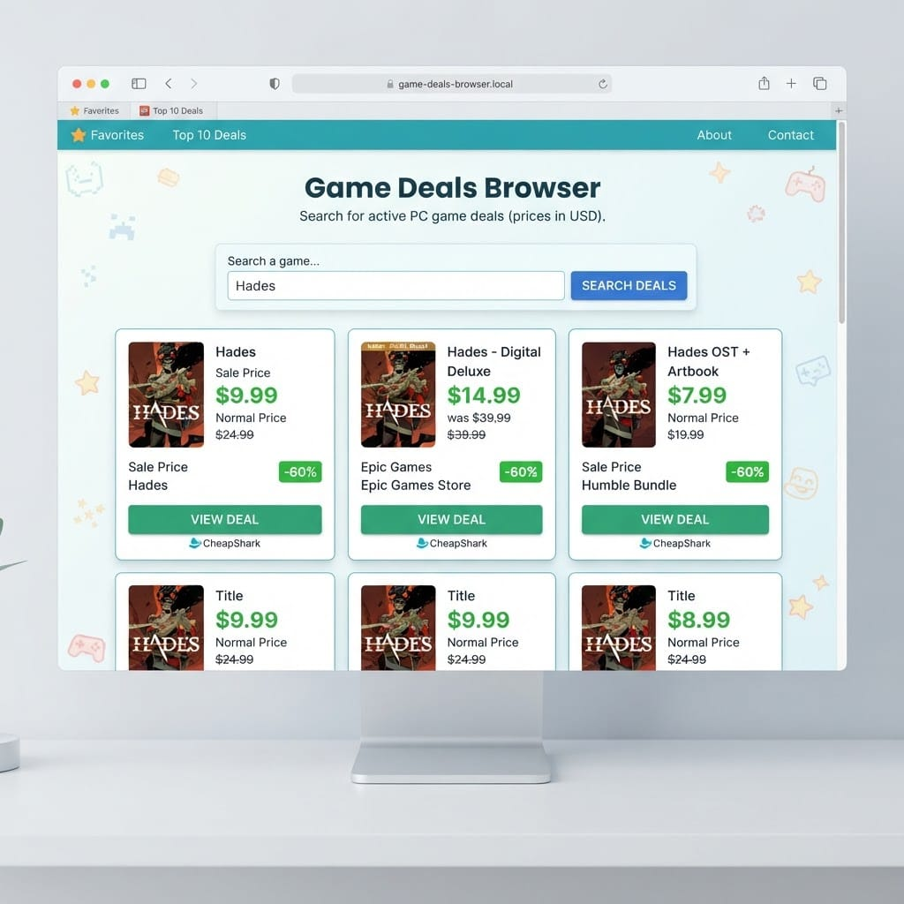
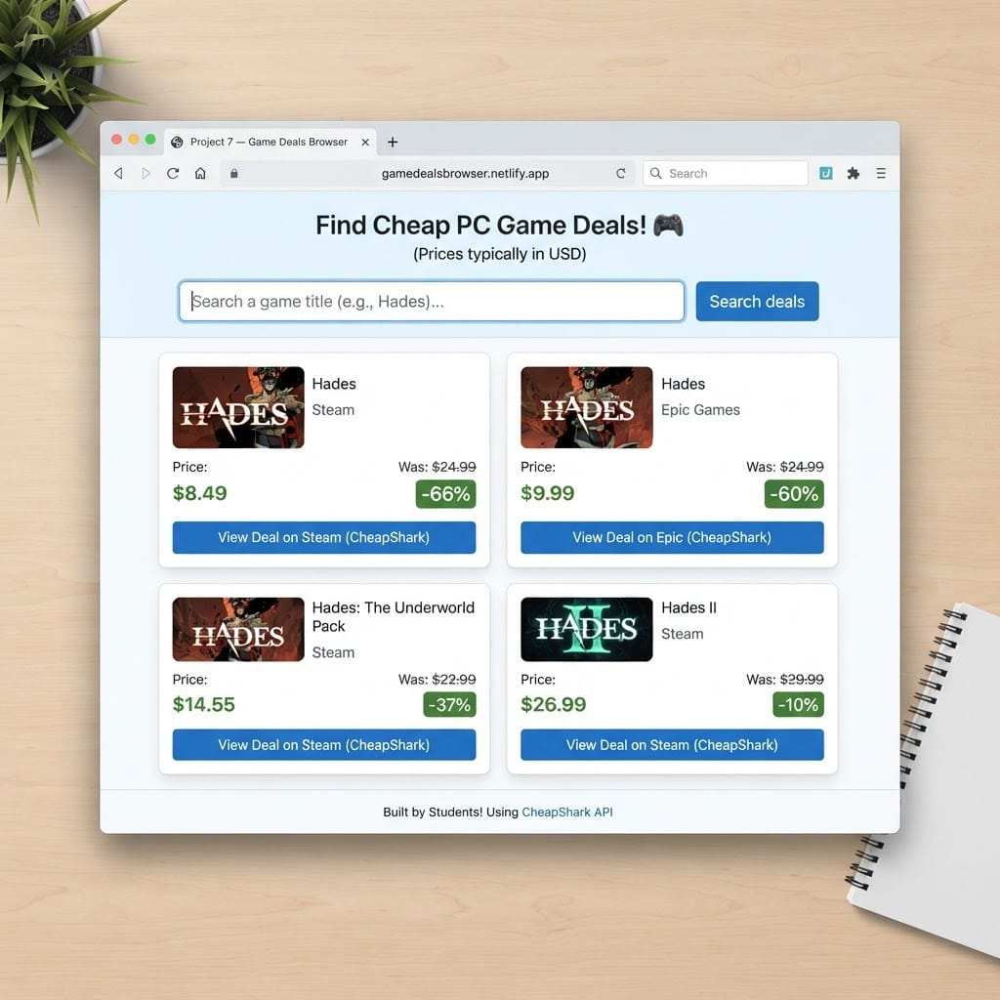
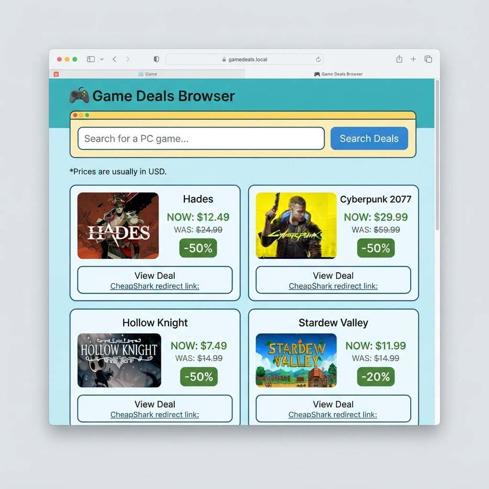

# Project 7 — Game Deals Browser

# Projekt 7 — Spelerbjudanden-bläddrare

> **Day 6–7 project guide / Projektguide Dag 6–7**
> Build a **one-page** game deals browser with plain **HTML, CSS, and JavaScript** — no frameworks. Publish on **GitHub Pages** as `index.html`.
>
> Bygg en **ensidig** spelerbjudanden-bläddrare med ren **HTML, CSS och JavaScript** — inga ramverk. Publicera på **GitHub Pages** som `index.html`.

---

## What you'll build / Vad du ska bygga

**English**
Search for a PC game title (e.g. `Hades`, `Celeste`) and see current **store deals**: sale price, normal price, discount %, thumbnail, and a link to the offer. Data comes from the free **CheapShark** API (no key).

**Svenska**
Sök efter en PC-speltitel (t.ex. `Hades`, `Celeste`) och se aktuella **butikserbjudanden**: reapriser, ordinarie pris, rabatt %, miniatyrbild och en länk till erbjudandet. Data kommer från det gratis **CheapShark**-API:et (ingen nyckel).

**User story / Användarberättelse:**

> As a student who likes games, I want to search for a game title and see cheap PC store deals, so I can practice fetching and displaying live JSON data.
> *Som student som gillar spel vill jag söka på en speltitel och se billiga PC-butikserbjudanden, så att jag övar på att hämta och visa live JSON-data.*

> ℹ️ **Notes / Anteckningar**
>
> - Prices are usually in **USD**. Say that clearly on the page.
> - This is an **educational demo**, not a shop. Deals can change or sell out.
> - CheapShark asks that deal links use their redirect URL (see below).
> - *Priser är oftast i **USD**. Skriv det tydligt på sidan.*
> - *Detta är en **utbildningsdemo**, inte en butik. Erbjudanden kan ändras.*

**Rules for GitHub Pages / Regler för GitHub Pages:**

- One-page app / Ensidig app
- Plain HTML/CSS/JS only / Bara ren HTML/CSS/JS
- No build tools, no npm, no frameworks / Inga byggverktyg, inget npm, inga ramverk
- File must be named `index.html` / Filen måste heta `index.html`
- No API key needed / Ingen API-nyckel behövs

**You need / Du behöver:** VS Code + a browser + a GitHub account

**API / API:** [CheapShark API](https://apidocs.cheapshark.com/)  
Base: `https://www.cheapshark.com/api/1.0`

---

## Illustrations / Illustrationer

*Example layouts — inspiration only. Build a simple version first!*
*Exempel-layouts — bara inspiration. Bygg en enkel version först!*







---

# Part 1 — Build a simple version by hand / Del 1 — Bygg en enkel version för hand

> Goal: a working deals page with **very little CSS**. Understand every line before using Cline.
> Mål: en fungerande erbjudandesida med **väldigt lite CSS**. Förstå varje rad innan du använder Cline.

**App loop / App-loop:**

```text
User types a game title (e.g. hades)
        ↓
GET /deals?title=...&pageSize=10
        ↓
Show deal cards (thumb, prices, % off, link)
```

---


## Step 1 — See the API in the browser / Steg 1 — Se API:et i webbläsaren

**English**
Open this URL (no key):

**Svenska**
Öppna denna URL (ingen nyckel):

```text
https://www.cheapshark.com/api/1.0/deals?title=hades&pageSize=5
```

You should see a **JSON array**. Each item looks roughly like:

```json
{
  "title": "Hades",
  "dealID": "....",
  "storeID": "1",
  "salePrice": "9.99",
  "normalPrice": "24.99",
  "savings": "60.024009",
  "thumb": "https://....jpg"
}
```

**Important fields / Viktiga fält:**


| Field         | Meaning                                                 |
| ------------- | ------------------------------------------------------- |
| `title`       | Game name                                               |
| `salePrice`   | Current deal price (USD string)                         |
| `normalPrice` | Usual price (USD string)                                |
| `savings`     | Percent saved (string, e.g. `"60.02"`)                  |
| `thumb`       | Small cover image URL                                   |
| `dealID`      | Used to build the redirect link                         |
| `storeID`     | Which store (Steam = often `"1"`) — optional for Part 1 |


**Deal link (required by CheapShark) / Erbjudandelänk (krävs av CheapShark):**

```text
https://www.cheapshark.com/redirect?dealID=DEAL_ID_HERE
```

> Tip: try also `celeste`, `stardew`, `minecraft`.
> *Tips: prova även* `celeste`*,* `stardew`*,* `minecraft`*.*

---


## Step 2 — Create the project file / Steg 2 — Skapa projektfilen

**English**

1. Create a folder, e.g. `game-deals`.
2. Create `index.html`.
3. Start with this skeleton:

**Svenska**

1. Skapa en mapp, t.ex. `game-deals`.
2. Skapa `index.html`.
3. Börja med denna grundram:

```html
<!DOCTYPE html>
<html lang="en">
  <head>
    <meta charset="UTF-8">
    <meta name="viewport" content="width=device-width, initial-scale=1.0">
    <title>Game Deals Browser</title>
  </head>
  <body>
    <!-- content goes here -->
  </body>
</html>
```

---


## Step 3 — Add the page structure (HTML) / Steg 3 — Lägg till sidstrukturen (HTML)

```html
<h1>Game Deals Browser</h1>
<p><strong>Educational demo — prices are usually in USD and can change.</strong></p>
<p>Search a PC game title and see current store deals (via CheapShark).</p>

<label>
  Game title
  <input id="query" type="text" value="hades" placeholder="e.g. hades, celeste, stardew">
</label>
<br><br>

<button id="searchBtn">Search deals</button>

<p id="status">Type a game title, then press Search deals.</p>
<div id="results"></div>
```

---


## Step 4 — Add a tiny bit of CSS / Steg 4 — Lägg till en liten bit CSS

```html
<style>
  body {
    font-family: Arial, sans-serif;
    max-width: 700px;
    margin: 24px auto;
    padding: 0 16px;
    line-height: 1.4;
  }
  input { margin-left: 8px; padding: 4px; min-width: 220px; }
  button { padding: 6px 12px; }
  .deal {
    border-top: 1px solid #ccc;
    padding: 12px 0;
  }
  .deal img {
    vertical-align: middle;
    margin-right: 8px;
  }
  .sale { font-weight: bold; }
  .normal { text-decoration: line-through; color: #666; }
  .savings { color: darkgreen; }
</style>
```

---


## Step 5 — Fetch deals + console.log / Steg 5 — Hämta erbjudanden + console.log

**English**
First, fetch deals for `hades` and log the JSON.

**Svenska**
Först: hämta erbjudanden för `hades` och logga JSON.

```html
<script>
  const API = "https://www.cheapshark.com/api/1.0";

  async function fetchDeals(title) {
    const url =
      API +
      "/deals?title=" +
      encodeURIComponent(title) +
      "&pageSize=10";

    const response = await fetch(url);
    if (!response.ok) {
      throw new Error("Deals API error: " + response.status);
    }
    const data = await response.json();
    console.log(data);
    return data;
  }

  async function testHades() {
    document.getElementById("status").textContent = "Loading deals for hades…";
    try {
      const deals = await fetchDeals("hades");
      document.getElementById("status").textContent =
        "Got " + deals.length + " deals — see Console (F12).";
    } catch (error) {
      console.error(error);
      document.getElementById("status").textContent = error.message;
    }
  }

  document.getElementById("searchBtn").addEventListener("click", testHades);
</script>
```

> ▶️ Save, open the file in the browser, click the button, open Console (`F12`). You should see an array of deals.
> *Spara, öppna i webbläsaren, klicka, öppna Console. Du ska se en array med erbjudanden.*

---


## Step 6 — Show deal cards on the page / Steg 6 — Visa erbjudandekort på sidan

**English**
Replace the script so Search uses the input, then renders each deal.

**Svenska**
Byt ut scriptet så att Sök använder inputfältet och visar varje erbjudande.

```html
<script>
  const API = "https://www.cheapshark.com/api/1.0";

  async function fetchDeals(title) {
    const url =
      API +
      "/deals?title=" +
      encodeURIComponent(title) +
      "&pageSize=10";

    const response = await fetch(url);
    if (!response.ok) {
      throw new Error("Deals API error: " + response.status);
    }
    const data = await response.json();
    console.log("deals", data);
    return data;
  }

  function formatMoney(value) {
    if (value === undefined || value === null || value === "") return "n/a";
    return "$" + Number(value).toFixed(2);
  }

  function formatSavings(value) {
    if (value === undefined || value === null || value === "") return "n/a";
    return Math.round(Number(value)) + "% off";
  }

  function dealLink(dealID) {
    return "https://www.cheapshark.com/redirect?dealID=" + encodeURIComponent(dealID);
  }

  function showDeals(deals) {
    const el = document.getElementById("results");
    if (!deals || deals.length === 0) {
      el.innerHTML = "<p>No deals found. Try another title (e.g. celeste, stardew).</p>";
      return;
    }

    el.innerHTML = deals
      .map(function (deal) {
        const thumb = deal.thumb
          ? ''
          : "";
        const link = deal.dealID
          ? '<p><a href="' + dealLink(deal.dealID) + '" target="_blank" rel="noopener">View deal</a></p>'
          : "";

        return (
          '<div class="deal">' +
          thumb +
          "<h2>" + (deal.title || "Untitled") + "</h2>" +
          '<p><span class="sale">' + formatMoney(deal.salePrice) + "</span> " +
          '<span class="normal">' + formatMoney(deal.normalPrice) + "</span> " +
          '<span class="savings">(' + formatSavings(deal.savings) + ")</span></p>" +
          "<p><em>Prices usually in USD · data from CheapShark</em></p>" +
          link +
          "</div>"
        );
      })
      .join("");
  }

  async function searchDeals() {
    const query = document.getElementById("query").value.trim();
    if (!query) {
      document.getElementById("status").textContent = "Please type a game title.";
      return;
    }

    document.getElementById("status").textContent = "Searching deals…";
    document.getElementById("results").innerHTML = "";

    try {
      const deals = await fetchDeals(query);
      document.getElementById("status").textContent =
        "Found " + deals.length + " deal(s) for \"" + query + "\".";
      showDeals(deals);
    } catch (error) {
      console.error(error);
      document.getElementById("status").textContent =
        error.message || "Something went wrong.";
    }
  }

  document.getElementById("searchBtn").addEventListener("click", searchDeals);
</script>
```

> ▶️ Try `hades`, `celeste`, `stardew`. Click **View deal** — it should open via CheapShark’s redirect.
> *Prova* `hades`*,* `celeste`*,* `stardew`*. Klicka **View deal** — länken ska gå via CheapSharks redirect.*

---


## Step 7 — Test your core features / Steg 7 — Testa dina kärnfunktioner


| Test / Test    | What to check / Vad du ska kolla             |
| -------------- | -------------------------------------------- |
| `hades`        | Several deals with prices + images           |
| `celeste`      | Different titles/prices                      |
| Empty input    | Friendly message                             |
| Nonsense title | “No deals found…” or 0 results               |
| View deal link | Opens CheapShark redirect (not a broken URL) |
| Console        | You see the deals JSON array                 |


---


## The complete simple page / Den kompletta enkla sidan

```html
<!DOCTYPE html>
<html lang="en">
  <head>
    <meta charset="UTF-8">
    <meta name="viewport" content="width=device-width, initial-scale=1.0">
    <title>Game Deals Browser</title>
    <style>
      body {
        font-family: Arial, sans-serif;
        max-width: 700px;
        margin: 24px auto;
        padding: 0 16px;
        line-height: 1.4;
      }
      input { margin-left: 8px; padding: 4px; min-width: 220px; }
      button { padding: 6px 12px; }
      .deal {
        border-top: 1px solid #ccc;
        padding: 12px 0;
      }
      .deal img {
        vertical-align: middle;
        margin-right: 8px;
      }
      .sale { font-weight: bold; }
      .normal { text-decoration: line-through; color: #666; }
      .savings { color: darkgreen; }
    </style>
  </head>
  <body>
    <h1>Game Deals Browser</h1>
    <p><strong>Educational demo — prices are usually in USD and can change.</strong></p>
    <p>Search a PC game title and see current store deals (via CheapShark).</p>

    <label>
      Game title
      <input id="query" type="text" value="hades" placeholder="e.g. hades, celeste, stardew">
    </label>
    <br><br>

    <button id="searchBtn">Search deals</button>

    <p id="status">Type a game title, then press Search deals.</p>
    <div id="results"></div>

    <script>
      const API = "https://www.cheapshark.com/api/1.0";

      async function fetchDeals(title) {
        const url =
          API +
          "/deals?title=" +
          encodeURIComponent(title) +
          "&pageSize=10";

        const response = await fetch(url);
        if (!response.ok) {
          throw new Error("Deals API error: " + response.status);
        }
        const data = await response.json();
        console.log("deals", data);
        return data;
      }

      function formatMoney(value) {
        if (value === undefined || value === null || value === "") return "n/a";
        return "$" + Number(value).toFixed(2);
      }

      function formatSavings(value) {
        if (value === undefined || value === null || value === "") return "n/a";
        return Math.round(Number(value)) + "% off";
      }

      function dealLink(dealID) {
        return (
          "https://www.cheapshark.com/redirect?dealID=" +
          encodeURIComponent(dealID)
        );
      }

      function showDeals(deals) {
        const el = document.getElementById("results");
        if (!deals || deals.length === 0) {
          el.innerHTML =
            "<p>No deals found. Try another title (e.g. celeste, stardew).</p>";
          return;
        }

        el.innerHTML = deals
          .map(function (deal) {
            const thumb = deal.thumb
              ? ''
              : "";
            const link = deal.dealID
              ? '<p><a href="' +
                dealLink(deal.dealID) +
                '" target="_blank" rel="noopener">View deal</a></p>'
              : "";

            return (
              '<div class="deal">' +
              thumb +
              "<h2>" +
              (deal.title || "Untitled") +
              "</h2>" +
              '<p><span class="sale">' +
              formatMoney(deal.salePrice) +
              "</span> " +
              '<span class="normal">' +
              formatMoney(deal.normalPrice) +
              "</span> " +
              '<span class="savings">(' +
              formatSavings(deal.savings) +
              ")</span></p>" +
              "<p><em>Prices usually in USD · data from CheapShark</em></p>" +
              link +
              "</div>"
            );
          })
          .join("");
      }

      async function searchDeals() {
        const query = document.getElementById("query").value.trim();
        if (!query) {
          document.getElementById("status").textContent =
            "Please type a game title.";
          return;
        }

        document.getElementById("status").textContent = "Searching deals…";
        document.getElementById("results").innerHTML = "";

        try {
          const deals = await fetchDeals(query);
          document.getElementById("status").textContent =
            "Found " + deals.length + ' deal(s) for "' + query + '".';
          showDeals(deals);
        } catch (error) {
          console.error(error);
          document.getElementById("status").textContent =
            error.message || "Something went wrong.";
        }
      }

      document.getElementById("searchBtn").addEventListener("click", searchDeals);
    </script>
  </body>
</html>
```

---


# Part 2 — Improve it with AI (Cline)


# Del 2 — Förbättra den med AI (Cline)

**English**
Now that the core works, use **Cline** in VS Code to improve the page — **one change at a time**. Keep it a **single static page** suitable for **GitHub Pages** (no React, Vue, Angular, no npm, no backend).

**Svenska**
Nu när kärnan fungerar, använd **Cline** i VS Code för att förbättra sidan — **en ändring i taget**. Behåll en **ensidig statisk sida** som passar **GitHub Pages** (ingen React, Vue, Angular, inget npm, ingen backend).

**How to work / Så här jobbar du:**

1. Open your `index.html` in VS Code.
2. Open the **Cline** chat (left sidebar).
3. Paste **one** prompt below.
4. **Read** the change → Accept only if you understand it → Test in the browser.
5. If something breaks, Undo and try a clearer prompt.

> 🏅 **Golden rule:** You must be able to explain what the AI changed.
> *Gyllene regel: Du måste kunna förklara vad AI:n ändrade.*

**Always remind Cline / Påminn alltid Cline:**

```text
Keep this as one plain HTML/CSS/JS file publishable on GitHub Pages.
Do not add frameworks, npm, or a backend.
Keep deal links as https://www.cheapshark.com/redirect?dealID=...
Keep the educational note that prices are usually in USD.
```

---


## Sample prompts — Design & layout / Exempel-prompts — Design & layout

```text
Improve the visual design of my Game Deals Browser using only CSS in the same index.html file. Keep all existing JavaScript behavior. Use a clean, modern, student-friendly look: clearer spacing, readable fonts, and a max-width layout.
This app must stay publishable on GitHub Pages as one static HTML file. Do not add React, Vue, npm, or any framework. Explain each CSS change with a short comment.
```

```text
Turn each deal into a simple card with light border, padding, rounded corners, thumbnail on the left and title/prices on the right (stack on small screens). Keep plain HTML/CSS/JS for GitHub Pages. No frameworks.
```

```text
Make sale price clearly larger/bolder, keep normal price struck through, and highlight the savings percentage in green. Plain CSS only. Must remain GitHub Pages–ready — one index.html, no frameworks.
```

```text
Improve mobile readability: full-width input and Search button on small screens, larger tap targets, readable deal text. CSS media queries only. No frameworks. Publishable on GitHub Pages.
```

---


## Sample prompts — User experience / Exempel-prompts — Användarupplevelse

```text
When I press Enter in the game title input, run the same action as Search deals.
Keep plain HTML/CSS/JS. Explain the change with a short comment.
This must stay a single static file publishable on GitHub Pages — no frameworks.
```

```text
Disable the Search deals button while a request is loading, and enable it again when the request finishes (success or error). Plain JavaScript only in index.html.
Do not add libraries. Keep it GitHub Pages–compatible.
```

```text
Show a clearer loading status, for example: Searching deals for "hades"… using the title the user typed. Do not change the API URL.
One static HTML file for GitHub Pages — no frameworks.
```

```text
If zero deals are returned, show a friendly empty-state with 3 example searches the user can try (hades, celeste, stardew valley).
Plain JS only. Must remain publishable on GitHub Pages.
```

```text
Add quick-select buttons for Hades, Celeste, and Stardew Valley that fill the input and run the search. Keep one index.html for GitHub Pages. No frameworks.
```

---


## Sample prompts — Extra features / Exempel-prompts — Extrafunktioner

```text
Add a number input "Max results" (default 10, min 1, max 20) and pass it as pageSize to the CheapShark /deals request. Keep one index.html for GitHub Pages.
Do not add frameworks. Explain the change with a short comment.
```

```text
Add an optional "Max price (USD)" number input. If filled, add upperPrice to the API query. If empty, do not send upperPrice. Plain JS only for GitHub Pages.
```

```text
Sort the displayed deals by salePrice (cheapest first) after fetching.
Explain the sorting with short comments. One static file — no frameworks.
```

```text
Fetch https://www.cheapshark.com/api/1.0/stores once, map storeID to storeName, and show the store name on each deal card. Cache the stores list in a variable.
Keep deal links as CheapShark redirect URLs. GitHub Pages–ready, no frameworks.
```

```text
Add a "Clear" button that empties the results area and resets the status message, without reloading the page. Plain HTML/CSS/JS for GitHub Pages.
```

```text
Above the list, show a short summary: number of deals shown and the cheapest salePrice found. Plain JS only. Must stay one static index.html for GitHub Pages.
```

---


## Sample prompts — Language & accessibility / Exempel-prompts — Språk & tillgänglighet

```text
Make the page bilingual: Game title / Speltitel, Search deals / Sök erbjudanden, View deal / Visa erbjudande, and the USD educational note in EN + SV.
Keep one HTML file. Must stay GitHub Pages–compatible — no frameworks.
```

```text
Improve accessibility: associate the title input with a label using for/id, clear button text, and make #status easy to find (e.g. role="status").
Plain HTML/CSS/JS only for GitHub Pages.
```

```text
Add a short "About this app" paragraph under the title: data from CheapShark, PC store deals for learning fetch/JSON, prices usually USD, student project for GitHub Pages. Do not change the fetch logic. No frameworks.
```

---


## Sample prompts — Code quality / Exempel-prompts — Kodkvalitet

```text
Refactor my script into small named functions (fetchDeals, formatMoney, formatSavings, dealLink, showDeals, searchDeals). Keep the same behavior.
Add short comments above each function. Do not introduce frameworks.
The file must remain one static index.html publishable on GitHub Pages.
```

```text
Add short comments above each function explaining what it does, so I can explain the code to my teacher. Do not change behavior.
Keep plain HTML/CSS/JS for GitHub Pages — no frameworks.
```

```text
Review my code for simple bugs (empty search, missing fields, broken deal links, missing encodeURIComponent) and fix them carefully.
Keep one static HTML file for GitHub Pages. Keep CheapShark redirect links.
```

---


## After improvements — Publish checklist / Efter förbättringar — Publiceringschecklista

**English**

1. Confirm `hades` / `celeste` still show deals.
2. Every **View deal** link uses `cheapshark.com/redirect?dealID=...`.
3. USD note is visible on the page.
4. Push `index.html` to a **public** GitHub repository.
5. Enable **GitHub Pages** and test the live URL.

**Svenska**

1. Bekräfta att `hades` / `celeste` fortfarande visar erbjudanden.
2. Varje **Visa erbjudande**-länk använder `cheapshark.com/redirect?dealID=...`.
3. USD-noten syns på sidan.
4. Push:a `index.html` till ett **offentligt** GitHub-repo.
5. Slå på **GitHub Pages** och testa live-URL:en.

---


## Demo tips (3 minutes) / Demotips (3 minuter)

**English**

- Search Hades → show sale vs normal price + % off.
- Open Console and point to one deal object (`salePrice`, `dealID`).
- Click **View deal** and explain the CheapShark redirect.
- One Cline improvement (cards, store names, or max price filter).

**Svenska**

- Sök Hades → visa rea vs ordinarie + % rabatt.
- Öppna Console och peka på ett deal-objekt (`salePrice`, `dealID`).
- Klicka **Visa erbjudande** och förklara CheapShark-redirecten.
- En Cline-förbättring (kort, butiksnamn eller maxprisfilter).

---


## API reference (quick) / API-referens (snabb)

```text
GET https://www.cheapshark.com/api/1.0/deals?title=hades&pageSize=10
GET https://www.cheapshark.com/api/1.0/deals?title=hades&pageSize=10&upperPrice=15
GET https://www.cheapshark.com/api/1.0/stores
Redirect: https://www.cheapshark.com/redirect?dealID={dealID}
```

- No API key / Ingen API-nyckel
- CORS supported for browser `fetch` / CORS stöds för `fetch` i webbläsaren
- Be kind: search when the user clicks — do not spam automatic requests
- Docs: [CheapShark API](https://apidocs.cheapshark.com/)

---

*Part of teknikkurs26 — Summer Coding Course for Youth · Sudanese Association*